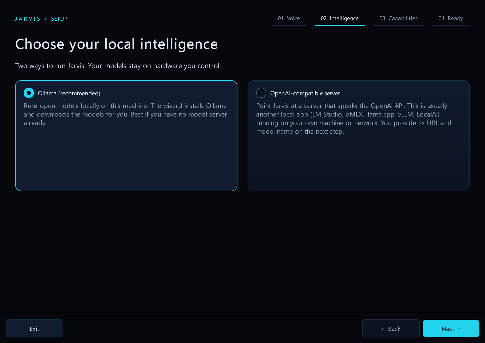
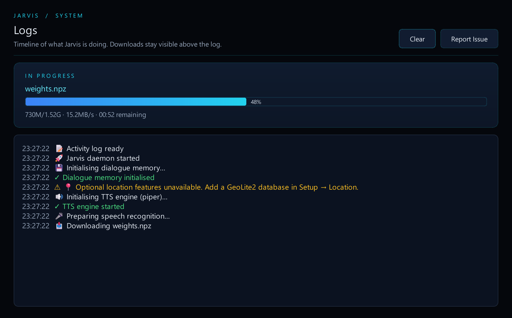
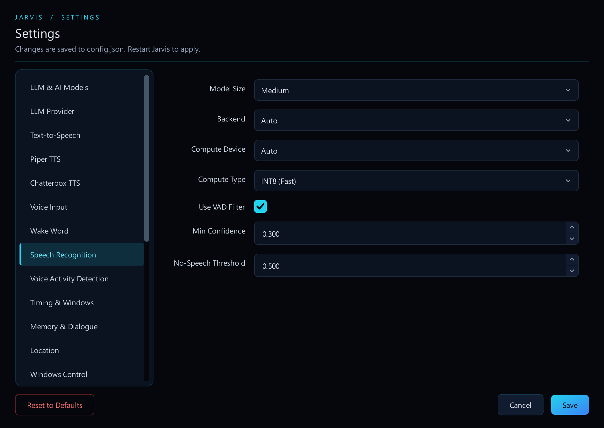
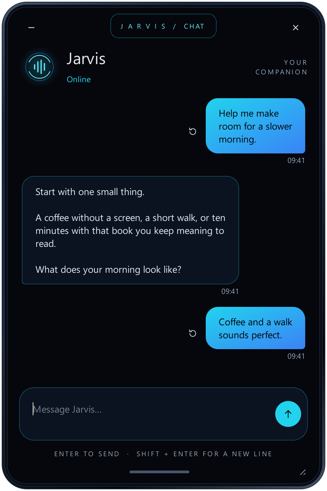

<div align="center">

# Jarvis

### Your intelligence. Your hardware.

A private, local-first voice assistant that lives on your computer.<br>
Talk naturally, as if Jarvis were a third person in the room.

**Voice-first · Local AI · Personal memory · No subscription required**

[**Download Jarvis →**](https://github.com/oweber3/jarvis/releases) &nbsp; · &nbsp; [Get started](#quick-install) &nbsp; · &nbsp; [Explore the app](#inside-jarvis) &nbsp; · &nbsp; [About this project](#about-this-project)

</div>

---

## An assistant that lives with you, not in the cloud

Jarvis is built to be part of the conversation, not another screen to type into. Talk through an idea, discuss plans with a friend, then ask “Jarvis, what do you think?” While listening, it keeps a short, temporary rolling transcript of nearby speech so it can join an ongoing conversation using what was just discussed, without you having to repeat the background.

Say “Jarvis” anywhere in a sentence and follow up naturally. Speech recognition, language models and speech synthesis run on hardware you control. The orb gives your voice assistant a presence on the desktop, glowing and moving with what Jarvis is doing; chat is there when you would rather type.

Your conversation memory stays on your computer. Sensitive information is redacted before it reaches model context or the saved diary. Web search, weather and connected tools use the network when you ask for those capabilities; local conversation does not require a cloud AI account.

<p align="center">
  
</p>

<p align="center"><sub>A voice, a face, and a place in the conversation.</sub></p>

## Quick Install

**1. Download the app.** Choose your platform from [GitHub Releases](https://github.com/oweber3/jarvis/releases), or [run from source](#for-developers) if no release is published for your platform.

| Platform | Package | Open |
| :--- | :--- | :--- |
| macOS · Apple Silicon | `Jarvis-macOS-arm64.zip` | Extract, move to Applications, then right-click → Open |
| Windows · x64 | `Jarvis-Windows-x64.zip` | Extract, then run `Jarvis.exe` |
| Linux · x64 | `Jarvis-Linux-x64.tar.gz` | Extract, then run `./Jarvis/Jarvis` |

**2. Choose your local models.** The setup wizard guides you through speech recognition and a model server. Use [Ollama](https://ollama.com/download), or connect an OpenAI-compatible server you already run, such as LM Studio, oMLX or llama.cpp. An optional step lets you allow the Claude and Codex reply modes; leave them off to stay fully offline.

**3. Make it yours.** Allow microphone access and let the first model downloads finish. When Jarvis reports that it is listening, try:

> “Jarvis, help me think through my day.”

Open **Chat** from the tray menu when you would rather type. Text replies are silent.

Click the orb in the Jarvis window to wake him without speaking, exactly as if you had said "Jarvis". Click it again to deactivate him.

When you wake him, the edges of every screen fill with soft holographic light that breathes with what he is doing (a slow breath while listening, a quicker pulse while thinking, following his voice while speaking) and fades once the conversation ends. It never takes focus, clicks pass straight through it, and screens showing a full-screen game or video are left alone. Turn it off in **Settings → Features → Wake Screen Effect**.

<details>
<summary><strong>Hardware and model choices</strong></summary>

Memory needs depend on model size, quantisation, context length and speech recognition. Both Ollama and OpenAI-compatible setup show a memory budget; you can edit estimates for models served through an OpenAI-compatible endpoint. Smaller models trade capability for lower resource use.

| Starting point | Chat model |
| :--- | :--- |
| Smaller hardware | `qwen3.5:0.8b` |
| Default | `qwen3.5:9b` |
| Most reliable PC control (12 GB+ GPU) | `gemma4:12b` |
| Alternatives | `gemma4:e2b`, `gemma4:e4b` |
| Larger local setup | `qwen3.8:27b` |

Budget memory for Whisper and, when different from chat, the fast model used for voice intent and tool routing. Apple Silicon uses unified memory; other GPUs use dedicated VRAM.

Optionally, **Settings → LLM & AI Models → Tool Model** lets a separate model choose and call tools while the chat model writes the reply. Setting it to the same model as chat costs no extra memory and made Qwen 3.5 noticeably more reliable; a different model only helps if both fit in memory together, or every request reloads them.

**Quick reference for PC control.** 28 everyday requests (volume, media, settings, windows, files, websites, PDFs, weather, web search), each run three times through Jarvis in local mode on an RTX 5070 (12 GB). "Correct" means the right tool with the right arguments and a sensible reply. Speed is the median time from request to reply.

| Model (chat, fast and tool) | Download | Correct | Speed |
| :--- | :--- | :--- | :--- |
| `gemma4:12b` | 7.6 GB | 82/84 | 2.7 s |
| `gpt-oss:20b` | 13.8 GB | 74/84 | 5.9 s |
| `granite4.2:8b` | 5.3 GB | 70/84 | 1.5 s |
| `qwen3.5:9b` (fast model `qwen3.5:4b`) | 6.6 + 3.3 GB | 64/84 | 1.7 s |
| `qwen3.5:4b` | 3.3 GB | 63/84 | 1.4 s |

Pick the highest row that fits in your GPU memory next to Whisper. When a web search came back with nothing useful, most models invented race results in one or two of three tries; only the `qwen3.5:9b` setup never did. Smaller GPUs and CPU-only setups were not measured. Full results and method: [docs/TOOL_MODEL_BENCHMARK.md](docs/TOOL_MODEL_BENCHMARK.md).

</details>

## What you can do

- **A third person in the room.** Bring Jarvis into an ongoing conversation with friends, talk through a problem aloud, or ask it to weigh in on a decision. “Jarvis, what do you think?” draws on the recent discussion, not just that one sentence.
- **Remember beyond one session.** Search your local diary and knowledge graph. Browse what Jarvis has stored in the Memory Viewer.
- **Run your Windows desktop by voice.** Apps, windows, files, settings, media and other apps' buttons, with routine actions done straight away and anything destructive asked first. See [Control your PC](#control-your-pc) for examples.
- **Make it yours.** Chain steps into a routine, open a whole desk set-up as a workspace, or add tools through MCP. See [Routines, workspaces and your own tools](#routines-workspaces-and-your-own-tools).
- **Use your Claude or ChatGPT subscription (optional).** When you want a stronger model than your PC runs, Jarvis can hand requests to Claude Code or Codex, signed in with the subscription you already pay for, so there is no API key and no separate billing. Speech, safety checks and the desktop controls stay on your PC, and "go local" switches back at any time. See [Switching who answers](#switching-who-answers).
- **Look back at your day (opt-in).** Turn on the activity log and ask “what was I working on yesterday afternoon?”. Jarvis answers from a local record of which app was in front and its window title; see [Activity log](#activity-log-optional).
- **Fast local commands.** Confident English commands such as “What time is it?”, “Open Word”, “Set volume to 30%” and “Pause the music” execute through the usual tools and safety checks without a model round trip. Voice skips the collection wait too. Uncertain requests keep the conversational path; app commands require a ready local catalogue. See [configuration](docs/CONFIGURATION.md#fast-local-commands) to disable fast routing.
- **Dictate into other apps.** Hold a hotkey, speak, then release to paste locally transcribed text. See the [platform limitations](#known-limitations) first.
- **Only your voice, and talk over Jarvis.** Optionally enrol your voice (`python scripts/enrol_voice.py`, a few prompted phrases) so Jarvis ignores games, videos and other people, and lowers its voice the moment you talk over it. The voiceprint stays on your PC beside `config.json`, never leaves it and can be deleted from Settings. Uses a small local model and needs no cloud. See [configuration](docs/CONFIGURATION.md#voice-recognition-and-talking-over-jarvis).
- **Type when you need to.** The companion chat shares your voice conversation and memory. Text replies are silent, and you can rewind a sent message to regenerate from that point.

### Bring Jarvis into the discussion

> **You:** We could have a picnic tomorrow.
>
> **A friend:** Depends on the weather. Should we plan something indoors instead?
>
> **You:** Jarvis, what do you think?

Jarvis can use the recent conversation to understand that you are asking about the weather for the picnic, rather than treating the last sentence as an isolated question. This is the experience it is built around. How reliably it understands the context depends on speech recognition and your chosen model; see the [evaluation results](EVALS.md).

### Control your PC

On Windows, Jarvis's built-in tools understand requests like these. Simple English commands run instantly without a model; everything else goes through the model you chose.

| Area | Try saying |
| :--- | :--- |
| Apps and windows | "Open Word", "put Apple Music on my second monitor", "move this to the left", "maximise it", "close this", "switch to the next desktop" |
| Files and folders | "Open my report", "find the PDF I downloaded yesterday", "what are the biggest files in Downloads?", "move it to Documents" |
| Settings and system | "Set volume to 30%", "pause the music", "turn the brightness down", "open Bluetooth settings", "what's using the most RAM?" |
| Other apps | "Click Save in this dialog", "in Notepad, open the Format menu", "go to page 42" or "jump to the methods chapter" in an open PDF |
| Your screen | "What's on my screen?", "what does this error mean?" |
| Everything else | Web search, weather, time, nutrition tracking and optional location awareness |

- **Follow-ups just work.** "Close this" acts on the window in front of you, and after Jarvis opens or moves something, "move it" or "close it" act on that exact window.
- **Asks before anything risky.** Deleting, overwriting, shutting down or clicking a control that sends, deletes or buys needs your confirmation. Password fields are never touched, files are only moved, copied or renamed inside your home folder, and nothing is ever overwritten silently. Jarvis cannot delete files at all until you turn on **Allow File Deletion** in Settings → Windows Control.
- **Sees your screen only when you ask.** The screenshot is read offline and never stored, and one switch in Settings removes the ability entirely.
- **Smart devices.** A Roku TV on your home network ("turn off the TV", "put on Netflix") is built in ([setup](docs/CONFIGURATION.md#roku-tv)); other devices connect through MCP, for example Home Assistant.

### Routines, workspaces and your own tools

- **Routines** chain anything Jarvis can do under one name. Do the steps once, say "save that as movie mode" and confirm the read-back. From then on "start movie mode" runs them all, asking first only when a step needs confirmation. [More on routines →](docs/CONFIGURATION.md#routines)
- **Workspaces** open a whole desk set-up at once. "Open my study workspace" opens the documents, sites and apps you listed, each on the monitor and zone you chose, including your PowerToys FancyZones layouts. [Set one up →](docs/CONFIGURATION.md#workspaces)
- **Your own tools** come from MCP servers: browser automation, smart-home control, GitHub, databases and more. Jarvis picks the relevant tools for each request. [Integration examples →](docs/CONFIGURATION.md#mcp-integrations)
- **Your own code** can live in `extensions/` as a local extension: tools, fast commands, a Settings page or an extra voice output for your own hardware, loaded only when you name it and untouched by Jarvis updates. [How extensions work →](extensions/README.md)

## Inside Jarvis

The supporting desktop interfaces keep setup, activity and settings within reach. The screenshots below use current widgets with demo data, each on its own row so you can read the interface without opening an image viewer.

### A guided start

Choose the runtime that fits your machine. Setup walks through local models, speech and optional capabilities without requiring you to edit a configuration file.

<p align="center">
  
</p>

### Progress you can actually follow

The activity timeline keeps ordinary events readable. Downloads have a separate card with transferred bytes, percentage, speed and remaining time when the downloader provides them. Loading and warmup are distinct stages.

<p align="center">
  
</p>

### Your setup, without the JSON

Choose models, tune speech recognition, configure tools and enable Low Power Mode from **Settings** in the tray menu.

<p align="center">
  
</p>

### A quiet companion to voice

When speaking is inconvenient, open Chat from the tray. It picks up the same conversation and memory, without reading text replies aloud. Away from the desk, [phone access](#phone-access-optional) brings the orb and the same conversation to your phone's browser.

<p align="center">
  
</p>

## Known limitations

This fork is developed and tested on Windows 11, and the desktop controls are Windows only. macOS and Linux keep the upstream voice, chat and memory features but are tested less. Model choice and hardware affect response quality and speed; [automated evaluation results](EVALS.md) show what is being measured.

- **macOS 26+ dictation is unavailable** because of a pynput incompatibility. This limitation concerns the global dictation hotkey.
- **Spoken “stop” can be mistaken for echo** while Jarvis is speaking.
- **No mobile app store app.** Phone access is a web page your PC serves to your phone's browser. It is text only (browsers allow the microphone only over HTTPS), works only while the PC is on, and needs the phone on your home network or your own VPN.
- **First-run downloads can take time.** Whisper and language models can be large. Check Logs for progress before assuming startup is stuck.
- **Whisper turbo needs a compatible backend.** The wizard hides it when the selected backend cannot load it; an existing unsupported selection uses `medium` instead.
- **Codex and Claude modes are cloud inference.** They are opt-in, send requests to OpenAI or Anthropic using your own Codex or Claude sign-in, take a few seconds per request, and stop with a clear message if a Codex or Claude Code update changes the interface they use (Codex's is marked experimental).
- **Follow-ups that don't name their target depend on the reply model.** "Close this" or "move this to my other monitor" act on the window you're looking at (never Jarvis's own windows); after Jarvis opens, focuses or places a window, "move it to the second monitor", "maximise it" or "close it" act on that exact window; after it uses the TV or the media player, "turn it off" or "pause it" go there. Codex mode handles these reliably; Claude mode receives the same records. Small local chat models (around 4B and below) usually fail to act on them, and mid-size local models sometimes report an action they did not take, so check the result when using local mode. "Make this louder" changes the PC's master volume (there is no per-app volume).
- **Controlling other apps depends on what they expose.** UI Automation works with controls an app publishes to Windows accessibility. Jarvis never moves the mouse or types keys for you, so a control without an accessible action, or one that needs keyboard focus, is reported as something to do by hand. Win32 list and combo boxes change their selection without notifying some apps. Small local models (such as `qwen3.5:0.8b`) are unreliable at app control, and mid-size local models sometimes describe a click instead of making it, so check the app when using local mode.
- **PDF page jumps use the viewer's page box.** PDFgear and Chrome move to the page directly. When there is no usable page box (Edge needs Enter to confirm one), Jarvis opens the file at that page instead, in Chrome when Chrome was showing it and otherwise in Edge, and says so.
- **The activity log is Windows only and records what is in front, not what you did there.** It sees the application and window title, so it can say you were in a spreadsheet called budget, not which cells you edited.
- **The orb and the wake screen effect do not hear the real audio level.** No microphone or voice level reaches them, so while Jarvis speaks they breathe with a synthetic speech rhythm, and while he listens they stay calm rather than following your voice.
- **Optional capabilities need their dependencies.** Location awareness needs a GeoLite2 database. Semantic memory search needs working embeddings; otherwise search falls back to keywords.

## Configuration

Most people can use **Settings** from the tray. Advanced setups can edit `~/.config/jarvis/config.json`. API keys are kept in Windows Credential Manager rather than in that file; Settings shows only whether one is stored.

[**Open the configuration guide →**](docs/CONFIGURATION.md)

Ollama inference uses a stable context window (`llm_num_ctx`, default 8192) and keeps models loaded for `llm_keep_alive` after each request (default 30 minutes, 1 minute in Low Power Mode). Routing (8 s) and chat (45 s) have separate timeout settings from tool execution (300 s); explicit overrides are honoured.

The guide covers local model servers, speech recognition, Low Power Mode, voices, dictation, location, MCP integrations, [monitor and zone placement](docs/CONFIGURATION.md#monitor-and-zone-placement) and troubleshooting.

### Dictation at a glance

| Platform | Default hotkey |
| :--- | :--- |
| Windows | Ctrl + Win |
| macOS, where supported | Ctrl + Option |
| Linux | Ctrl + Alt |

Hold to record and release to paste. Double-tap for hands-free recording. Optional filler-word removal, a custom dictionary and dictation history are available in Settings. macOS needs Accessibility permission; Linux requires X11, with limited Wayland support.

### Bring your own tools

Connect MCP servers for browser automation, Home Assistant, GitHub, databases and more. Credentials and network access depend on the tools you choose. Review a server's permissions before enabling it. Most catalogue servers run on Node.js, which Jarvis does not bundle: when you tick one in setup and Node.js is missing, the wizard can install the official LTS release with winget, or links to the download.

[Integration examples and server settings →](docs/CONFIGURATION.md#mcp-integrations)

### Switching who answers

Jarvis answers with its local model by default. If you allow them in **Settings → Reply Mode** (or on the setup wizard's optional **Cloud reply modes** step, which also checks that each one is installed and signed in), it can instead hand requests to **ChatGPT through Codex** or **Claude through Claude Code**, both running hidden in the background. Switch at any time, with no restart:

- say "Jarvis, use Claude", "use ChatGPT" or "go local";
- or pick a mode under **Reply Mode** in the tray menu.

The tray shows which mode is active, and the orb and chat window show a small badge for a cloud mode. A mode you have not allowed cannot be switched to, so a misheard command never sends anything to the cloud. "Go local" always runs on your PC. Your choice is remembered for the next start.

### Codex mode (optional)

If the local model is too slow or misreads you, Jarvis can let **Codex**, already installed and signed in on your PC, interpret requests and use Jarvis's tools. Jarvis runs Codex as a hidden background process: the Codex app does not need to be open, and no chat, window or focus is involved. Speech recognition, speech output, redaction, safety checks, confirmations and the Windows controls stay on your machine. This mode is **off by default**, and Jarvis works fully offline without it.

> ☁️ **Privacy.** In this mode the request, the recent conversation you allow and the results of tools Codex calls are sent to OpenAI using your Codex ChatGPT sign-in. Each request runs in a fresh, temporary Codex session that is not saved to your Codex history; turn off *Share Recent Conversation* and no earlier conversation is sent at all. So that "move it to the second monitor" or "pause it" knows what you mean, Jarvis also sends its own short record of what it acted on in this conversation: the last few windows it opened, focused or placed (application name, window handle, display and zone), the device it controlled, the media player's name and what kind of thing is on the clipboard, never window titles, file paths, track names, clipboard contents or what you said; turn off *Share Recent Desktop Actions* to withhold it. With each request made at the PC (not from your phone) it also sends which window is in front (application name, window handle, display and state, never its title), so "close this" works; turn off *Share The Window You're Looking At* to withhold it. Your diary, memory, meal log, settings and raw audio are not sent. Tools that read personal data stay off unless you turn them on in Settings.

<details>
<summary>Turn it on, and switch back</summary>

1. **Sign in to Codex with ChatGPT** (open the Codex app once and sign in). Jarvis uses that sign-in and refuses to run with an API-key sign-in, so it never switches you to API billing.
2. **Allow the mode.** In Settings, open **Reply Mode**, tick **Allow Codex Mode** and restart Jarvis when asked. Then say "use ChatGPT" or choose it in the tray (or make it the start-up mode on the same page). The model (`gpt-6-luna` by default), reasoning effort (`low`) and Codex executable are on the **Codex** page. Jarvis finds the Codex command line on `PATH` or the copy installed with the Codex app; if neither exists, set the full path to `codex.exe`.
3. **Check the start-up output.** Jarvis prints `✓ Codex is ready in the background`, or the reason it is not (not signed in, model or effort not available, Codex not found or too old).

To go back, say "go local" or choose **Local** in the tray. Nothing from this mode runs in local mode, and Jarvis stops only the Codex process it started.

**Good to know**
- Say "Jarvis, stop" or press Stop in the chat to cancel a request.
- Destructive actions still ask you first. Codex saying you approved is never treated as approval.
- Codex gets only Jarvis's tools: its own shell, file, web, app and plugin tools and your other MCP servers are switched off for Jarvis's sessions, without changing your Codex settings.
- Requests count towards your Codex plan, and wake-word conversation still uses one small local model to decide you were speaking to Jarvis.
- Expect a few seconds per request. Measure it on your own PC before relying on it.

</details>

### Claude mode (optional)

Jarvis can also let **Claude** interpret requests and use Jarvis's tools, through the Claude Code command line you already have installed and signed in with your Claude subscription. Jarvis runs it hidden in the background, one short-lived process per request; no Claude window is involved. As with Codex, speech, redaction, safety checks, confirmations and the Windows controls stay on your machine, and the mode is **off by default**.

> ☁️ **Privacy.** In this mode the request, the recent conversation you allow and the results of tools Claude calls are sent to Anthropic using your Claude subscription sign-in. Jarvis never uses an API key: it refuses to run when Claude Code is signed in any other way, and removes API keys and proxy settings from the background process's environment. Each request starts a fresh session that is not saved to your Claude history, with Claude Code's own tools (shell, files, web), your settings, hooks, plugins, memory files and analytics switched off for that process only; your global Claude Code settings are not changed. The same *Share Recent Conversation*, *Share Recent Desktop Actions*, *Share The Window You're Looking At* and personal-data switches as Codex mode are on the **Claude** settings page.

<details>
<summary><strong>Turn it on, and switch back</strong></summary>

1. **Sign in to Claude Code** with your Claude subscription (run `claude auth login` once). `claude auth status` should report that you are logged in.
2. **Allow the mode.** In Settings, open **Reply Mode**, tick **Allow Claude Mode** and restart Jarvis when asked. Then say "use Claude" or choose it in the tray. The model (`sonnet` by default), effort (`low`) and Claude executable are on the **Claude** page; Jarvis finds `claude` on `PATH` or in `%USERPROFILE%\.local\bin`.
3. **Check the output.** When the mode starts, Jarvis prints `✅ Claude is ready in the background`, or the reason it is not (not signed in, signed in with an API key, model or effort not available, Claude Code not found).

To go back, say "go local" or choose **Local** in the tray. Jarvis stops only the Claude Code processes it started.

**Good to know**
- Say "Jarvis, stop" or press Stop in the chat to cancel a request.
- Destructive actions still ask you first. Claude saying you approved is never treated as approval.
- Requests count towards your Claude plan. While Claude mode is active, one idle Claude Code process (about 190 MB) waits for the next request so it starts quickly.
- Expect a few seconds per request: on Haiku, measured on a desktop PC in normal use, about 4 s for a reply or one tool step and up to about 13 s for two tool steps.

</details>

### Activity log (optional)

Off by default. When you turn it on in **Settings → Activity Log** (and restart Jarvis), Jarvis records which application is in the foreground, its window title with emails, tokens and similar secrets removed, and when you are idle. It never records keystrokes, screen contents or files. Ask “what was I working on this morning?” or “how long was I in Word yesterday?” and the local model answers from that record.

- **Stays on this PC.** The record lives in Jarvis's database, is kept for 30 days by default and is never added to your diary or memory graph. A reply that quotes it is not printed to the log, so it cannot end up in a bug report.
- **You stay in control.** The tray has **Pause Activity Log** and **Delete Activity History…** (which asks first). Password managers (1Password, Bitwarden, KeePass and others) and private browsing windows are never recorded, and you can edit both lists in Settings.
- **Not shared with Codex or Claude** unless you also switch on **Share With Codex And Claude** on the same page. Until then those modes cannot see it at all.
- Time with no keyboard or mouse input (five minutes by default) counts as idle, so watching a long video shows as idle.

### Phone access (optional)

Off by default. Turn it on in **Settings → Phone Access** (or from the tray's **Phone Access**) and restart Jarvis. Your PC then serves a small web app to your phone's browser: the live orb, the same conversation as voice and the chat window, one-tap quick actions, and Approve and Deny for actions that ask for confirmation on the desktop.

1. Open **Phone Access** from the tray and press **Pair a phone**. It shows a six-digit code and the links to open, such as `http://192.168.1.20:8765/`.
2. Open the link on your phone, enter the code and give the phone a name. Add the page to your home screen if you like.

- **No cloud in between.** The phone talks straight to your PC. Away from home, use your own VPN such as Tailscale, Headscale or WireGuard; Jarvis answers only private network addresses, so an accidental port forward exposes nothing.
- **Only phones you pair.** Each phone gets its own key, stored on the PC only as a hash. Remove a phone in **Phone Access** and it stops working at once.
- **Same rules as typing at the PC.** Requests from the phone are redacted, use the same reply mode and tools, and join the same conversation and diary. Turn off **Approve From The Phone** to keep confirmations on the PC.
- **Read replies aloud** (off by default) uses the phone's own voice.
- Without the tray, `python -m jarvis.remote pair` prints a pairing code, `devices` lists paired phones and `revoke <id>` removes one.

## Troubleshooting

<details>
<summary><strong>Bluetooth microphone will not start</strong></summary>

Select the headset's microphone/input profile in Settings, not its playback device. Jarvis uses the selected input for listening and dictation, tries compatible mono, stereo and device-native capture formats, then converts multichannel input to mono for speech recognition. If that input is unavailable, select another microphone in Settings. If capture still fails, check that the microphone works in your system's recorder and share the error from Logs; Bluetooth driver/profile limitations can still prevent capture.

</details>

<details>
<summary><strong>Linux says Listening, but never hears speech</strong></summary>

Check Logs for missing-callback or silent-input warnings. Verify the recording source and mute state in PipeWire/PulseAudio, and select a microphone rather than an output monitor. Enable `voice_debug` in Settings for capture-level diagnostics. See the [troubleshooting guide](docs/CONFIGURATION.md#troubleshooting).

</details>

<details>
<summary><strong>Downloads look paused</strong></summary>

Open **Logs** from the tray. The progress card shows transfer details when available and elapsed waiting time when updates pause. After downloading, loading the model into memory is a separate step.

</details>

<details>
<summary><strong>Warmup passed, but a request timed out</strong></summary>

Warmup checks model loading with a small probe, not a full request. Voice intent detection has a separate timeout from chat. Check the limit shown in the log and your local server's responsiveness.

</details>

<details>
<summary><strong>The Mac gets warm, or I want lower background usage</strong></summary>

Enable **Settings → Features → Low Power Mode**. It skips LLM startup warmup and shortens Ollama model residency while keeping speech recognition ready. The first model request after idle may take longer.

</details>

[More troubleshooting →](docs/CONFIGURATION.md#troubleshooting)

## For Developers

<details>
<summary><strong>Run from source</strong></summary>

```bash
git clone https://github.com/oweber3/jarvis.git
cd jarvis

# macOS
bash scripts/run_macos.sh

# Windows (PowerShell, with Micromamba)
pwsh -ExecutionPolicy Bypass -File scripts\run_windows.ps1

# Linux
bash scripts/run_linux.sh
```

Running from source also enables Chatterbox TTS. Piper works in both packaged and source installations.

</details>

**Adding a capability?** Start with the [extension checklist](.agents/skills/new-tool/SKILL.md). It helps you choose between a routine, a workspace, an MCP server, a fast command and a new built-in tool, and lists everything a new tool needs. AI coding agents are pointed to it by `AGENTS.md`.

<details>
<summary><strong>Refresh the screenshots</strong></summary>

With the desktop dependencies installed in your Python environment:

```bash
PYTHONPATH=src python scripts/capture_readme_screenshots.py
```

The capture script uses the real widgets and illustrative data, isolates configuration in a temporary directory, and blocks network connections and background workers. It does not launch the daemon or use personal conversations. Keep screenshots on separate rows at readable widths.

</details>

[Evaluation results](EVALS.md) · [Report a bug](https://github.com/oweber3/jarvis/issues) · [Contribute](https://github.com/oweber3/jarvis/pulls)

## Privacy & Storage

Local AI is the default, not a paid upgrade. No cloud AI service is required.

- **Conversation memory:** stored locally under `~/.local/share/jarvis`.
- **Sensitive information:** redacted before model context and saved diary entries. The in-memory chat still shows what you typed.
- **Activity log (opt-in, off by default):** foreground application names, redacted window titles and idle periods, in the same local database. Never sent anywhere unless you allow it for Codex or Claude, and never written to the diary or logs. Delete it any time from the tray.
- **Phone access (opt-in, off by default):** your PC serves the conversation to phones you pair, over your own network or VPN only. Paired phones are stored as hashed keys next to the database; the phone's copy of the conversation is held in memory and gone when Jarvis stops.
- **Network boundaries:** model downloads, web tools and enabled integrations can make network requests. An external model endpoint receives the requests you send to it.

<details>
<summary><strong>Reduce optional network access</strong></summary>

Use a local model endpoint, download the required models first, disable web tools and leave MCP integrations empty. These settings turn off search and automatic location detection:

```json
{
  "web_search_enabled": false,
  "wikipedia_fallback_enabled": false,
  "mcps": {},
  "location_auto_detect": false,
  "location_cgnat_resolve_public_ip": false,
  "location_enabled": false
}
```

These options are not a network firewall. Other online tools and app update checks may still use the network; enforce network restrictions separately if required.

</details>

## About this project

This project is based on [isair/jarvis](https://github.com/isair/jarvis), the original work by Baris Sencan, and is released under the same non-commercial licence: it is free for personal, non-commercial use under the terms in [LICENSE](LICENSE). It keeps the local-first, offline-by-default design and adds Windows desktop control, reply modes (local, Codex and Claude), routines, workspaces, local extensions and the orb HUD interface. Bugs and ideas for this version go to its [issue tracker](https://github.com/oweber3/jarvis/issues).
