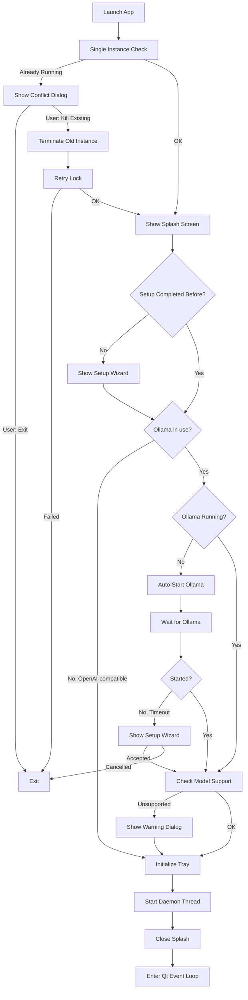
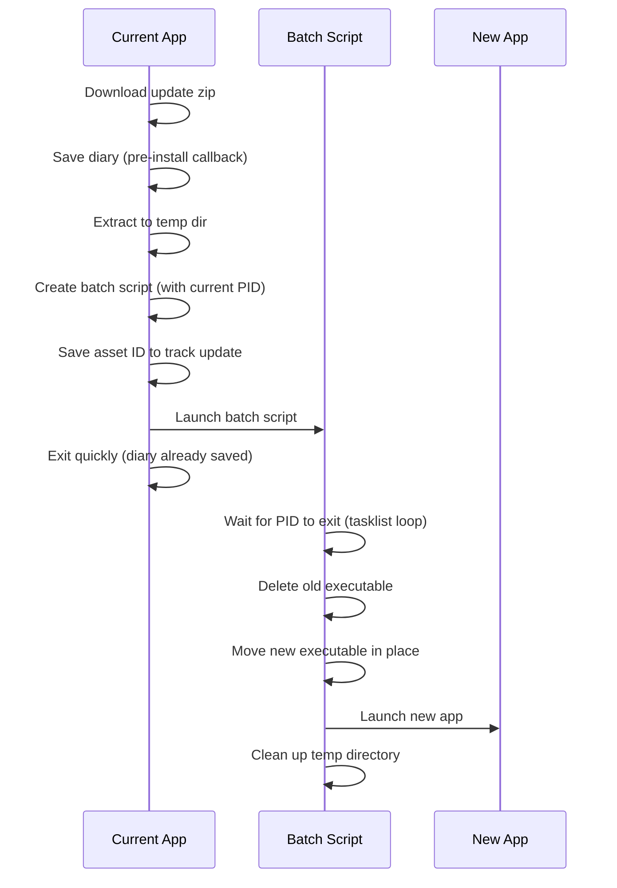

# Desktop App Specification

This document outlines the architecture and behavior of the Jarvis Desktop App - a cross-platform PyQt6 system tray application that provides a graphical interface for the Jarvis voice assistant.

## Overview

The desktop app is a **separate package** from the core `jarvis` module. It depends on `jarvis` for assistant functionality but `jarvis` has no knowledge of or dependency on the desktop app. This separation allows:

- Running Jarvis headless (CLI/daemon only)
- Building alternative UIs (web, mobile) without modifying core logic
- Keeping PyQt6 dependencies isolated from the core package

## Package Structure

```
src/desktop_app/
├── __init__.py          # Package exports, main() entry point
├── app.py               # JarvisSystemTray, windows, startup flow
├── splash_screen.py     # Startup splash (hosts the live orb)
├── setup_wizard.py      # First-run setup wizard
├── settings_window.py   # Auto-generated settings UI from config metadata
├── face_widget.py       # Face window + file-backed daemon state channel
├── orb_widget.py        # Reactive orb visual (see orb_widget.spec.md)
├── wake_overlay.py      # Wake screen effect on every screen's edges (see wake_overlay.spec.md)
├── win32_overlay.py     # Windows-only helpers of the wake screen effect
├── themes.py            # The one orb HUD palette, Qt stylesheet, roles and line icons
├── repository.py        # Repository slug and pre-filled issue-report links
├── diary_dialog.py      # End-of-session diary update dialog
├── chat_window.py       # Text chat interface (see chat_window.spec.md)
├── phone_access_dialog.py # Phone pairing and paired phones (see jarvis/remote/remote.spec.md)
├── memory_viewer.py     # Flask-based memory browser (palette from themes.py)
├── updater.py           # Update checking logic
├── update_dialog.py     # Update notification dialogs
└── desktop_assets/      # Icons and images
```

## Startup Flow

The startup sequence ensures a smooth user experience even when dependencies (like Ollama) aren't ready.



### Key Startup Features

1. **Splash Screen**: Shows immediately to provide visual feedback while loading. It stays hidden throughout the unreachable-server warning and any setup wizard opened from that warning, then resumes when startup continues (whether the wizard is accepted or cancelled).
2. **Provider-aware Ollama gating** (`_ollama_runtime_flags` in `app.py`): The Ollama server-start and model-verification steps run only when a local provider actually uses Ollama. A pure OpenAI-compatible setup (chat and embeddings both remote) skips them entirely. `get_required_models()` is provider-aware, so model verification pulls exactly the models that run locally: chat + intent-judge when chat is on Ollama, and the embedding model when embeddings are on Ollama. When chat is on Ollama, a missing model opens the setup wizard; when only embeddings are local (remote chat), a missing embedding model surfaces a clear non-blocking instruction (memory search falls back to keyword matching until it is pulled). The unsupported-chat-model check runs only on the Ollama chat path. `should_show_setup_wizard()` returns False for an OpenAI-compatible chat provider.
3. **Ollama Auto-Start**: When Ollama is in use and not running, automatically starts it (up to 15s wait). If the wait times out, the setup wizard opens so the user can diagnose connectivity; cancelling the wizard exits the app. The desktop app records ownership only for an Ollama runtime it launches in this session. On app exit, it stops that owned runtime (on Windows the whole process tree, so Ollama's `llama-server.exe` model runners do not outlive the server) and leaves any pre-existing user-managed Ollama process running.
3a. **OpenAI-compatible reachability check** (`_check_openai_compat_reachable` in `app.py`): Jarvis cannot start a third-party server the way it starts Ollama, so on a pure OpenAI-compatible setup it checks the server answers `GET /v1/models` and, if not, shows a one-off warning naming the address (never the API key) and pointing to Settings, then continues. The user only otherwise discovers a down server when their first request fails.
4. **Single Instance Lock**: Prevents multiple copies from running simultaneously. If another instance is detected, shows a dialog offering to close the existing instance and start fresh.
5. **Crash Detection**: Detects previous crashes and offers to submit bug reports

### CLI Flags

| Flag | Purpose |
|------|---------|
| `--smoke-test` | CI smoke-test mode. Creates a minimal offscreen QApplication, runs the daemon initialisation (`daemon.main(smoke_test=True)`), prints `SMOKE_TEST_PASSED` on success (or the error + traceback on failure), and exits with code 0 or 1. Forces UTF-8 stdout/stderr on every OS (emoji-safe even when the console is an ANSI code page or absent) and Qt's offscreen platform on Linux so the gate never depends on xvfb/xcb. Bypasses the single-instance lock, crash detection, splash screen, setup wizard, Ollama checks, model verification, tray icon, and event loop. Used by the `release-smoke.yml` workflow to verify the bundled binary starts without missing DLLs or broken imports before fast-forwarding `main` to `develop`. |

## Main Components

### JarvisSystemTray

The central controller that manages:

- **System tray icon** with context menu. Clicking the icon does nothing special. The icon is the orb's data sphere as an emblem (nested broken shells of light filaments, brightest at the rim, on a dark disc, no text) in the colour of the state (`generate_icons.py`, colours from `ORB_PALETTE`): slate while the assistant is not listening, cyan while listening, indigo (`icon_thinking`) while a reply is worked out. The thinking state follows the orb's state, polled twice a second. The context menu and the reply-mode submenu use the shared theme: plain-text labels, each with a line icon from the palette (`themes.line_icon`), never emoji. The menu reads, in order: View Logs, Memory Viewer, Dictation History, Chat, Phone Access, Show Face, Reply Mode, the activity log items, Setup Wizard, Settings, Runtime Status, Check for Updates, Reinstall GPU libraries (when available); Open Config Directory, Open Data Directory; Start Listening or Stop Listening above the status line (`Status: Listening` or `Status: Stopped`, with a dot in the status colour: green while listening, muted while stopped); Quit.
- **Orb click wake and stop**: a left click on the orb in the face window wakes Jarvis exactly as saying the wake word alone does (it then waits for the request). A click while he is already woken (waiting for the request, or in the follow-up hot window) deactivates him instead, discarding any partly heard request. A click while he is thinking or speaking (a voice reply being generated or spoken, a typed chat request, or a Codex or Claude request in flight) stops it at once like a spoken stop: the reply is dropped, speech is cut off, no hot window follows and the orb returns to idle; that click does not also wake him. It acts only while the assistant is listening. Bundled mode calls `jarvis.daemon.toggle_manual_wake()` in process; subprocess mode writes a bare `__WAKE__` line to the daemon's stdin.
- **Activity log items** (`activity_menu.py`, opt-in feature; see `jarvis/memory/activity_log.spec.md`): `Pause Activity Log`, a checkable item that follows `activity_log_paused` and is disabled while the log is off, and `Delete Activity History…`, which asks for confirmation (No by default) and is available even while the log is off. Bundled mode calls `jarvis.daemon.set_activity_paused` and `delete_activity_history` on a worker thread; subprocess mode writes `__ACTIVITY__:{"action": "pause" | "resume" | "delete"}` to the daemon's stdin; with no daemon the stored setting or the database is changed directly. The items read the stored state each time the menu opens.
- **Reply mode submenu** (`Reply Mode: <active>`, `reply_mode_menu.py`): one radio item per mode (Local with a home icon, ChatGPT (Codex) and Claude with a cloud icon). A cloud mode not allowed in Settings is disabled and labelled "(allow in Settings)". Choosing an item only requests the switch; the checked item, the title and the badges always follow the mode the daemon reports, so a refused or failed switch never shows as active. Bundled mode calls `jarvis.daemon.set_reply_mode` on a worker thread and hears the result through a `bridge.modes` listener; subprocess mode writes `__REPLY_MODE__:{"mode": ...}` to the daemon's stdin and reads `__REPLY_MODE_STATE__:` events from its output (never shown in the log viewer). With no daemon running, the submenu shows and edits the start-up mode from Settings. See `bridge/bridge.spec.md`.
- **Wake screen effect** (`wake_overlay.py`, see `wake_overlay.spec.md`): from the wake word until the conversation ends, the edges of every screen fill with click-through holographic light in the orb's colours that breathes and pulses with the state, wherever the face window is or when it is hidden. It is switched by `wake_overlay_enabled` (Settings → Features), applied as soon as Settings are saved, and removed on quit.
- **Mode badge**: the face window shows a small badge over the top of the orb naming the active cloud mode after a cloud line icon; it is hidden in local mode. The chat window shows the same badge (see `chat_window.spec.md`). Its look comes from the theme (`MODE_BADGE_STYLESHEET`).
- **Daemon lifecycle** (start/stop the Jarvis voice assistant)
- **Window management** (log viewer, memory viewer, face window)
- **Update checking** on startup and on-demand
- **Runtime diagnostics** (`Runtime Status`): shows whether the assistant is listening, the daemon mode/PID, whether Low Power Mode is active, whether Ollama is needed/running, whether Jarvis owns the current Ollama runtime, active chat/embedding models, and configured MCP server count. The dialog is informational and never starts or stops services.

### Windows

| Window | Purpose |
|--------|---------|
| **LogViewerWindow** | Real-time log output from the daemon, with "Report Issue" button |
| **MemoryViewerWindow** | Web-based memory browser (Flask server) |
| **FaceWindow** | Floating window hosting the reactive orb visual (see `orb_widget.spec.md`) |
| **SettingsWindow** | Auto-generated config editor with tabbed categories |
| **SetupWizard** | First-run configuration (Ollama, models, profile) |
| **DictationHistoryWindow** | Scrollable list of past dictations with copy/delete/clear actions |
| **ChatWindow** | Text chat interface alongside voice; shares one conversation with the voice path and is enabled only while the daemon is running (see `chat_window.spec.md`) |
| **PhoneAccessDialog** | `Phone Access` in the tray: turn phone access on, pair a phone with a one-time code, list and remove paired phones. Works on the shared device files, so it needs no daemon IPC (see `jarvis/remote/remote.spec.md`) |

### Activity log and downloads

- The log viewer uses a timestamped timeline with distinct success, warning and error colours from the shared theme. Messages are inserted as plain text, including tracebacks.
- Download updates appear in a live card above the timeline, showing the filename, percentage, transferred/total bytes, speed and remaining time when supplied by the downloader. Unknown totals use an indeterminate bar, never a fabricated percentage.
- Repeated updates are coalesced; the timeline retains download start/completion events and all ordinary messages. Completion of a small metadata file must not hide another active model download.
- The progress card is visible only while work is active: it hides when the last download completes, when MLX Whisper reports readiness, or when the listener announces listening. Completion remains in the timeline. A subsequent download or preparation stage shows the card again; repeated final updates do not leave a permanent 100% card.
- After 15 seconds without a transfer update, the card states how long it has been waiting. It does not invent byte progress. Model loading/warmup is a separate indeterminate stage, followed by readiness or an error.
- Both bundled output capture and subprocess output support carriage-return progress and strip terminal control sequences. The desktop sets `TQDM_POSITION=-1` before loading dependencies so Hugging Face emits byte progress to non-terminal output, respecting explicit user environment overrides.
- Clear resets both the timeline and download state. Report Issue includes the visible progress snapshot and applies the existing redaction rules to it.
- Missing optional location support is reported once at startup with a pointer to Setup, without printing the full installation guide.
- Missing optional location support is a warning, rendered in yellow because it degrades available functionality.

Window visibility is user-controlled: starting or stopping the assistant never shows or hides the log viewer or the face window. The windows open automatically once at app launch; after that the tray menu's `View Logs` and `Show Face` actions are the only controls over their visibility (the diary dialog shown while stopping is raised on top but leaves those windows' visibility untouched).

**Face state follows the daemon lifecycle**: the orb animates from states written by the daemon (`JarvisStateManager`, file-backed for cross-process use). The daemon changes state only through `jarvis.assistant_state.set_state`, which forwards each state to `JarvisStateManager` and also notifies in-process subscribers such as local extensions (`jarvis/extensions/extensions.spec.md`). Whenever the daemon goes down — the tray's Stop/Start Listening toggle, an unexpected exit, or the setup wizard pausing it — the tray resets the face to `ASLEEP` so it never looks awake while no daemon is running. Starting the daemon lets the daemon's own state writes take over again.

### Tray Menu: GPU Library Recovery (Windows)

`cuda_recovery.py` exposes the `Reinstall GPU libraries` action. The tray adds it only when running on Windows, an NVIDIA driver is detected (`%SystemRoot%\System32\nvcuda.dll` exists), and the bundled `install_cuda.ps1` script is on disk. Clicking it confirms with the user, then re-runs `install_cuda.ps1` via `ShellExecuteW` with the `runas` verb so UAC elevates the process before it writes into `Program Files\Jarvis\cuda`. This is the only user-facing recovery path when the original Inno Setup install of cuBLAS/cuDNN fails — the installer's own task fires once per install and the script's marker file used to make subsequent reinstalls skip the CUDA step. The runtime probe in `jarvis.listening.listener._print_cuda_unavailable_hint` points users at this action by name when it falls back to CPU.

The Inno Setup script also runs a `VerifyCudaInstall` hook after the CUDA download task completes. The hook checks for the `.cuda_installed` marker (which `install_cuda.ps1` only writes after every expected DLL is present and SHA-verified) and surfaces a `MsgBox` pointing at `{app}\cuda\install.log` and the tray recovery action when the marker is missing. This is what makes a hidden install failure visible to the user instead of letting the installer report success on a half-installed CUDA tree.

### DictationHistoryWindow Behaviour

- **Backing store**: File-backed via `DictationHistory` (`src/jarvis/dictation/history.py`); entries are newest-first with `id`, `text`, `timestamp`, `duration`. Disk is the source of truth — the window must not assume its in-memory instance is authoritative.
- **Hidden windows are inert**: Signals from the dictation engine must not mutate the widget tree while the window is hidden; pending entries are surfaced on next open instead. The engine persists entries regardless, so no data is lost.
- **On show, reload from disk and rebuild**: The window reads disk state on every show, because the daemon may be in a separate process (subprocess mode) or may have recorded entries while the window was hidden (bundled mode). In-memory state alone is not trusted.
- **While visible, poll for external writes**: A short interval timer watches the history file's mtime and reloads on change so subprocess-mode dictations appear without requiring a re-open.
- **Rebuilds replace the container**: `_reload()` builds a fresh list container and installs it into the scroll area via `takeWidget()` + `setWidget()`; the previous container is hidden and `deleteLater()`'d. This atomic swap sidesteps every class of orphan-during-paint issue that surgical layout edits invite.
- **Reload deferred off showEvent**: `showEvent` schedules the rebuild via `QTimer.singleShot(0, ...)` rather than mutating the widget tree inline, so the first paint pass sees a stable tree.
- **ASCII-only `strftime` format strings**: On Windows with the bundled Python 3.11, `datetime.strftime` routes through the C locale encoder and raises `UnicodeEncodeError` on non-BMP codepoints. When that exception escapes a Qt slot invocation, Qt6Core triggers a fast-fail (0xc0000409) and the whole app dies. Timestamp labels put anything beyond plain ASCII (such as the `·` separator) outside `strftime`.

### LogViewerWindow Features

- Real-time log streaming from daemon
- Monospace font for readability (JetBrains Mono on macOS, Consolas elsewhere)
- **Report Issue button**: Opens GitHub issue with:
  - Pre-filled bug report template
  - Auto-redacted log contents (emails, tokens, JWTs, passwords, etc.)
  - Logs in collapsible `<details>` section
  - Version and platform info
  - Log truncation preserves the init section (everything up to the last `─`×50 separator) + recent tail (most useful for debugging); middle lines are truncated

### Action Confirmation Dialog
High-risk assistant actions (`CONFIRM_DIALOG`, see `reply.spec.md` "Action Safety") are confirmed in a modal dialog using the shared theme. It shows the action, the target, any important consequence, and Confirm and Cancel buttons. Voice cannot answer it. The core publishes the pending confirmation through a callback the desktop app registers, so `jarvis` has no dependency on the desktop app; with no callback registered such actions are refused. The dialog is shown without blocking any caller: requests from worker threads are marshalled to the GUI thread, and the registered presenter returns a handle whose `close()` is safe from any thread. The answer applies only to the pending action it was opened for and is delivered once; Cancel, Escape and closing the window all count as Cancel. When the request expires, is replaced or the desktop shuts down, the core closes the dialog, and a click that races the close is ignored.

### Splash Screen

Animated loading screen shown during startup with:

- The live orb (`OrbWidget`, the same widget as the face window) held in its thinking look, captioned "starting up"
- Status text updates ("Checking Ollama...", "Starting daemon...")
- Frameless, centered, always-on-top

## Daemon Integration

The desktop app runs the Jarvis daemon in a **QThread** (bundled mode) or **subprocess** (development mode).

```
┌─────────────────────────────────────────┐
│           Desktop App (Main Thread)      │
│  ┌─────────────────────────────────┐    │
│  │         Qt Event Loop            │    │
│  │  - Tray icon interactions        │    │
│  │  - Window management             │    │
│  │  - Signal/slot communication     │    │
│  └─────────────────────────────────┘    │
│                   │                      │
│                   │ signals              │
│                   ▼                      │
│  ┌─────────────────────────────────┐    │
│  │      DaemonThread (QThread)      │    │
│  │  - Runs jarvis.daemon.main()     │    │
│  │  - Captures stdout/stderr        │    │
│  │  - Emits logs to LogViewer       │    │
│  └─────────────────────────────────┘    │
└─────────────────────────────────────────┘
```

### Threading: worker QThreads never die while running

All long-lived worker QThreads in the desktop app inherit `KeepAliveWorker`
(`src/desktop_app/qt_worker.py`): `DaemonThread`, `SetupCheckWorker`,
`_LLMReachWorker`, `ServerCheckWorker` (app.py) and every setup-wizard
worker. The class keeps each started worker referenced in a class-level
registry until its OS thread has fully finished (released via the built-in
`finished` signal). Dropping the last Python reference to a winding-down
QThread — for example from a completion slot that clears the attribute
holding it — destroys a running QThread and Qt aborts the whole app with
"Fatal Python error: Aborted" on the main thread (#584/#575/#576; the
setup-wizard crash class #509/#407/#239). Because of this, worker
subclasses must never shadow the built-in `finished` signal — custom
completion signals use other names (`check_done`, `completed`, `done`).

`DaemonThread`'s `finished` slot (`_on_daemon_finished`) is connected with
`Qt.QueuedConnection`: the signal is emitted from the worker's OS thread,
and the slot mutates Qt UI state (menu actions, tray icon, face state), so
it must run on the main thread.

### Daemon Callbacks

The desktop app registers callbacks with the daemon for:

- **Diary updates**: Shows DiaryUpdateDialog when session ends
- **Clean shutdown**: Ensures graceful exit with diary save

#### Bundled Mode (QThread)

In bundled mode, the daemon runs in the same process, so callbacks can be set directly via `set_diary_update_callbacks()`. The DiaryUpdateDialog receives:
- `on_chunks`: List of conversation chunks being summarized
- `on_token`: Streaming tokens as the diary is generated
- `on_status`: Status messages ("Writing diary entry...")
- `on_complete`: Completion signal (success/failure)

#### Subprocess Mode (Development)

In subprocess mode, the daemon runs as a separate process. IPC is achieved via stdout:
- **Diary updates**: Daemon emits JSON events prefixed with `__DIARY__:` (e.g., `__DIARY__:{"type":"token","data":"Hello"}`)
- **Reply mode**: the daemon emits `__REPLY_MODE_STATE__:{"type": "state", "data": {"mode", "enabled"}}` after start-up and every switch; the tray writes `__REPLY_MODE__:{"mode": ...}` to switch
- **Chat events**: Daemon emits `__CHAT__:` events (start/complete/busy); the desktop app sends queries in via `__CHAT_QUERY__:` lines on the daemon's stdin, cancellation via a bare `__CHAT_CANCEL__` line, and rewind via `__CHAT_REWIND__:` lines (see `chat_window.spec.md`)
- Desktop app intercepts these lines from the log stream
- DiaryUpdateDialog's `process_log_line()` parses and emits signals
- Chat IPC lines are marshalled onto the Qt main thread via `ChatIpcSignals`, then `_on_chat_ipc_line()` forwards them to `ChatWindow.process_ipc_line()`
- When the daemon starts, stops, or a subprocess exits unexpectedly, the tray updates any open ChatWindow lifecycle banner and clears or refreshes its subprocess stdin submit function so the window never writes to a dead pipe.
- Same UI experience as bundled mode

## Theme System

Every window, dialog, menu and the memory viewer page wears the orb's cinematic cyan/blue HUD look, defined once in `themes.py`:

- `ORB_PALETTE` holds the colours of the live orb (backdrop, cyan, sky, blue, indigo, slates) and the status hues (green, amber, red). The orb paints its states from it.
- `HUD_COLORS` is the one UI palette, derived from `ORB_PALETTE`: surfaces (`bg_*`, `panel_top` for the top-lit end of a panel gradient), accents (`accent_*`, `indigo_glow`), text (`text_*`, all meeting WCAG AA on every surface), borders (`border*` and `hairline`, the faint cyan edge of HUD panels and dividers), and the status colours (`success*`, `warning*`, `error*`, each with glow and border variants where a tinted panel needs them).
- `HUD_THEME_STYLESHEET` renders the shared stylesheet template (`build_theme_stylesheet`) with that palette and the type stacks (`FONT_UI`, `FONT_MONO`). `apply_theme(widget)` and `themed_stylesheet(extra)` add the SVG indicator icons (check, radio, menu check, arrows), which are drawn from the palette.
- `CHAT_THEME_STYLESHEET` adds the chat window's own rules (see `chat_window.spec.md`); `MODE_BADGE_STYLESHEET`, `FACE_STYLESHEET` and `SPLASH_STATUS_STYLESHEET` style the small surfaces outside a themed window.

**Visual language.** Windows open with the HUD header (`hud_heading(section, title, subtitle)`): a small upper-case, wide-tracked cyan eyebrow `JARVIS / <SECTION>` (`eyebrow`), a 20 px title, a muted subtitle, then a 1 px cyan hairline (`divider`). Panels are card surfaces with a faint top-lit gradient, a cyan hairline edge and a 10 px radius. Controls use a 6 px radius; quiet buttons are outlined plates that light up cyan on hover, the main action is the filled cyan-to-blue gradient, destructive actions are outlined red. Lists, the Settings sidebar and menus mark the selected row with the cyan glow fill and a 2 px cyan bar on the left; tabs use a 2 px cyan underline. Every window keeps its wrapped text whole at its smallest size: a minimum size that ignores how tall word-wrapped labels grow is raised to fit them.

**Roles.** Window modules never carry a colour, a stylesheet or a font size of their own. They name roles, and the shared stylesheet styles them:

- Object names: `QLabel#eyebrow`, `#title`, `#title-error`, `#subtitle`, `#section_title`, `#heading`, `#heading_large`, `#emphasis`, `#body`, `#description`, `#detail`, `#muted`, `#hint`, `#key`, `#value` (monospace), `#code`, `#link`, `#badge` (`-success`, `-warning`), `#chip`, `#empty_state`, `#notice_error`, `#detail_panel`, `#status-success|warning|error|muted`; `QPushButton#primary`, `#secondary`, `#success`, `#danger`, `#toggle`; `QFrame#card`, `#inset`, `#divider`; `QListWidget#nav`; `QTextEdit#console`; the wizard roles under `QWizard`.
- Dynamic properties for states that change at run time: `[compact="true"]` (small buttons, compact status rows), `[tone="success|warning|error|muted"]` (status text found by its own object name), `[selected="true"]`, `[active="true"]`, and the chat window's `[kind]`, `[busy]`, `[presence]` and `[chatRole]`.
- `set_role(widget, role)` and `set_state(widget, name, value)` change a role or a state and restyle the widget at once.

`HUD_COLORS[...]` lookups remain only where a widget paints itself (the orb, the splash panel, the chat avatar, the log timeline's coloured lines) and in the HTML of the memory viewer and its error page. Amber appears only as the warning status colour.

**No emoji on screen.** Nothing the desktop app draws carries an emoji: tray and menu items, window titles, labels, buttons, dialogs, the setup wizard, Settings (category names, field labels and choices from the metadata, the MCP catalogue) and the memory viewer page use plain text. Where an icon helps, it is a line icon from `LINE_ICONS` (24-unit drawings stroked in a palette colour with round caps): `line_icon(name)` gives a `QIcon` in the secondary text colour that lights up light cyan when active and dims when disabled, or one fixed palette colour (`line_icon(name, colour_key)`, for a status dot); `icon_file(name, colour_key)` writes one for rich text. Console and log output keep their emojis (AGENTS.md); the log viewer shows log lines as they are.

The memory viewer page (Flask HTML) generates its CSS variables from `HUD_COLORS` and its icons as one hidden SVG sprite from `LINE_ICONS` (`<use href="#i-name">`, stroked in `currentColor`), draws its graph canvas from those variables, and uses system font stacks only. It makes no external request: no web fonts, scripts or stylesheets are fetched.

## Update System

The desktop app includes an auto-update mechanism:

1. **Check**: Queries the GitHub releases API of this build's repository (`GITHUB_REPO` in `repository.py`, the same slug the Report Issue links use) for newer versions. A repository that publishes no releases (or is not public, which GitHub reports as 404) reads as "no update", never as an error
2. **Notify**: Shows dialog with changelog and download option
3. **Download**: Downloads new installer with progress bar
4. **Install**: Platform-specific installation (see below)

Updates are only available in bundled mode (PyInstaller builds).

### Platform-Specific Update Installation

| Platform | Strategy |
|----------|----------|
| **macOS** | Extracts the update zip with `ditto -x -k` (Python's `zipfile` drops the symlinks Qt/Qt WebEngine frameworks rely on, producing a bundle macOS refuses to launch with "Jarvis.app can't be opened"; the release workflow creates the zip with the matching `ditto -c -k --keepParent`). Falls back to `zipfile.extractall` only when `/usr/bin/ditto` is missing — i.e. unit tests on Linux CI; production macOS always ships ditto, so the fallback never runs in the field. Then creates a shell script that waits for the current process (by PID via `kill -0`) to exit, moves the old `.app` aside to `Jarvis.app.backup` (one-generation rollback), moves the new bundle in (if either move fails, it logs `Update failed`, puts the previous bundle back where it was, reopens it and stops, so a failed swap never leaves the user without an app), strips `com.apple.quarantine` so Gatekeeper doesn't re-prompt on unsigned builds, re-registers the swapped bundle with `lsregister -f` (LaunchServices caches the old inode across the `mv` and a bare `open` silently no-ops otherwise), relaunches with `open -n`, and falls back to execing the bundle's inner binary via `nohup` if `open` fails. Script output is captured to `~/Library/Logs/Jarvis/updater.log` (size-capped) so detached failures leave a diagnostic trail. The executable name is read from the new bundle's `CFBundleExecutable`, not hardcoded. No Finder/AppleScript automation. Pattern mirrors Squirrel.Mac's `ShipIt` helper. |
| **Windows** | Creates a batch script that waits for the current process (by PID via `tasklist`) to exit, then runs the Inno Setup installer with `/SILENT` so the installer's own progress window provides visual feedback during install, then relaunches the upgraded exe. Rollback is handled by Inno Setup's own in-session rollback + retained uninstaller data. |
| **Linux** | Creates a shell script that waits for the current process (by PID via `kill -0`) to exit, moves the old directory to `Jarvis.backup` for rollback, moves the new directory in, and relaunches |

### Update Flow (Windows/Linux)



### Important Notes

- **Diary is saved before update installation**: The `pre_install_callback` mechanism ensures the diary is saved before the update process begins, so no data is lost
- **Commit-based detection (develop)**: For develop channel updates (where the release version stays "latest"), the installed build's commit — stamped as `dev-<sha>` in `_version.py` by CI (`dev-<full sha>`) or `scripts/build_installer.*` (`dev-<7-hex sha>`) — is compared against the commit the latest release was built from (`**Commit**: <sha>` in the release body, added by `release.yml`). Only a mismatched commit shows the update prompt, so a fresh install from the release page or a CI re-upload of the same commit no longer triggers it. When either side can't be determined (e.g. a `dev-local` source run, or a release published without the commit stamp), the updater falls back to tracking the GitHub asset ID
- **Robust Windows update**: The batch script waits for the actual process to exit (by PID) rather than using a fixed timeout, ensuring the update doesn't fail due to slow shutdown
- **Visible Windows install progress**: The Inno Setup installer runs with `/SILENT` (not `/VERYSILENT`) so its own progress window is visible while the install runs — bridging the gap between the download dialog closing and the new app launching, which would otherwise look like a hang
- **Translocated app (macOS)**: macOS runs a quarantined app opened outside Applications from a randomised read-only copy under `/AppTranslocation/`, which can never be replaced. `update_install_blocker()` detects this, and choosing Update Now shows a dialog telling the user to move Jarvis.app into Applications and open it from there, instead of downloading an update that cannot apply. `install_update_macos` refuses such a path as well
- **Quarantine stripping (macOS)**: The shell script runs `xattr -dr com.apple.quarantine` on the newly-installed bundle. Builds are unsigned (ad-hoc signing breaks Qt WebEngine's symlinks — see `release.yml`), so without this step Gatekeeper may re-trigger the "unidentified developer" prompt on every update
- **One-generation rollback (macOS, Linux)**: The previous `.app` / directory is moved aside to `<name>.backup` rather than deleted outright, so a user can restore the prior version manually if the new one fails to launch. The backup from the previous update is cleared before creating a new one, so at most one backup exists on disk at a time. This is a simplified version of Squirrel's versioned-folder rollback — enough safety for a single-bundle install, without the architectural overhead

## Memory Viewer

A Flask-based web interface for browsing conversation history:

- Runs on `localhost:5050`
- **Bundled mode**: Flask runs in a daemon thread
- **Development mode**: Flask runs as subprocess
- Opens in embedded QWebEngineView or system browser (macOS fallback)
- **Request guard**: the server has no login, so a `before_request` hook answers only the viewer itself. A `Host` that is not `localhost`, `127.0.0.1` or `::1` (DNS rebinding) gets 403, and so does an `Origin` that differs from the request's own `Host` (cross-site requests, another local server). Requests with no `Origin` are served

## Error Handling

### Crash Detection

1. On startup, creates a `.crash_marker` file
2. On clean exit, removes the marker
3. On next startup, if marker exists → previous session crashed
4. Offers to submit crash report to GitHub Issues
5. The crash log goes through the same redaction rules as Report Issue before it is previewed, so the dialog shows exactly what the pre-filled issue carries

### Crash Reports Carry the Native Stack (macOS)

"Fatal Python error: Aborted" crashes are C-level aborts whose native
stack faulthandler cannot capture — it only dumps Python frames, which for
the abort family (#584/#575/#576) shows nothing but the main thread parked
in `app.exec()`. On macOS the OS still writes a full report with native
frames to `~/Library/Logs/DiagnosticReports/Jarvis-*.ips`. On the next
launch, `collect_macos_crash_report()` finds the newest report newer than
the previous crash log and appends its exception type, termination
indicator and the crashed thread's top native frames to the crash-dialog
content and the report-issue body, so these aborts become diagnosable.

### Fallbacks

- **No Ollama**: Shows setup wizard or auto-starts
- **No WebEngine**: Opens memory viewer in system browser
- **Model not supported**: Warning dialog with option to change
- **Update failed**: Error dialog with details

## Platform-Specific Behavior

| Feature | macOS | Windows | Linux |
|---------|-------|---------|-------|
| Tray icon | Native menu bar | System tray | System tray |
| Ollama start | `open -a Ollama` | `ollama serve` (hidden) | `ollama serve` |
| Crash logs | `~/Library/Logs/Jarvis` | `%LOCALAPPDATA%\Jarvis` | `~/.jarvis` |
| Memory viewer | System browser* | Embedded WebEngine | Embedded WebEngine |

*macOS bundled apps use system browser due to QtWebEngine sandbox issues.

## File Locations

| File | macOS | Windows | Linux |
|------|-------|---------|-------|
| Config | `~/.config/jarvis/` | `%APPDATA%\jarvis\` | `~/.config/jarvis/` |
| Database | `~/.local/share/jarvis/` | `%LOCALAPPDATA%\jarvis\` | `~/.local/share/jarvis/` |
| Crash logs | `~/Library/Logs/Jarvis/` | `%LOCALAPPDATA%\Jarvis\` | `~/.jarvis/` |
| Instance lock | `~/Library/Application Support/Jarvis/` | `%LOCALAPPDATA%\Jarvis\` | `~/.jarvis/` |
