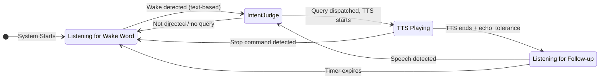

# Listening Flow Specification v2

This document outlines the voice listening architecture. The system uses a **transcript-first** approach where speech is continuously transcribed, and an LLM intent judge extracts queries with full context.

## Architecture Overview

### Capture format and health

The input stream tries mono at the configured sample rate. Unsupported channel
counts or sample rates trigger bounded retries on the same selected input:
mono, stereo and the device's advertised maximum channel count, at the configured
and native rates, without duplicate attempts. Access and device-availability
errors are not retried as format failures. Both the Windows permission probe and
continuous capture use this negotiation and input selection. Name matching skips
output-only devices; a missing named microphone produces an actionable error
rather than silently selecting another input. Multichannel samples are averaged
to mono before framing and speech detection.

Frames always span the configured 10, 20 or
30 ms at the actual capture rate; unsupported frame durations use 20 ms. Partial
callback blocks are retained until a complete frame is available and discarded
on audio-state resets. WebRTC VAD receives a 16 kHz mono PCM copy, including when
the hardware captures at 44.1 or 48 kHz. Utterances retain native-rate samples
until resampling for Whisper, preserving their duration.

VAD errors emit a single warning and use the configured energy threshold instead
of silently discarding speech. Capture health is checked every five seconds with
a monotonic clock. Missing callbacks, silent samples, callback errors, PortAudio
status flags and dropped queue blocks are reported outside the audio callback.
Warnings are transition-based; dictation pauses suspend health checks. With
`voice_debug`, diagnostics include callback/frame counts, speech-frame counts,
peak level and capture rate, without saving microphone audio. Linux warnings
point users to PipeWire/PulseAudio recording-source routing.

The capture queue between the audio callback and the listener thread holds
`intent_judge_timeout_sec` (counted up to the Settings maximum of 30 s) plus
2 s of audio, at least 64 blocks. The intent judge runs on the listener thread,
so speech the user starts while it decides is kept; anything beyond that bound
is dropped and reported by the health check. Each block is one frame, so a
block's capture time is estimated from the blocks still queued behind it, and
speech timing (utterance start and end, the end of speech, echo flags and
hot-window checks) uses capture time rather than the time the listener got to
it. A collection does not complete while more than about 100 ms of captured
audio is waiting, so speech said while the judge decided joins the request.

Audio-frame processing is limited to VAD and utterance assembly. Completed
utterances are enqueued for a single FIFO Whisper worker. Transcription results
return to the listener loop in order, where transcript storage and intent
processing remain serialised. An error while processing one transcript drops
that utterance with a warning and a debug log; the loop keeps listening. Echo
timing estimates use the default speech rate when `tts_rate` is empty. The bounded transcription backlog reports an
explicit warning when full rather than blocking microphone-frame consumption
or silently losing an utterance. A dictation pause clears captured audio and
invalidates transcription work started before the pause, including a decode
that finishes after dictation resumes. Listener shutdown discards pending
transcriptions and results; an in-progress Whisper call is given a bounded
grace period and cannot dispatch a late transcript. Transcript echo flags use
the utterance capture interval against TTS timing. The job carries that
capture-time context through Whisper to echo rejection, stop-command handling
and intent processing, so later TTS playback cannot reclassify an older
utterance.

```
┌─────────────────────────────────────────────────────────────────┐
│                         Audio Stream                            │
└───────────────────────────┬─────────────────────────────────────┘
                            │
            ┌───────────────┼───────────────┐
            ▼               ▼               ▼
┌───────────────┐                  ┌───────────────┐
│     VAD       │                  │   TTS Output  │
│ (speech gate) │                  │   Tracking    │
└───────┬───────┘                  └───────────────┘
        │
        ▼
┌───────────────┐
│    Whisper    │
│ (transcribe)  │
└───────┬───────┘
        │
        ▼
┌───────────────────────────────────────┐
│     Rolling Transcript Buffer         │
│     (2 minutes, with timestamps)      │
│                                       │
│  Segments include:                    │
│  - text, start_time, end_time         │
│  - energy level                       │
│  - is_during_tts flag                 │
└───────────────────┬───────────────────┘
                    │
                    ▼ (on wake detection)
┌───────────────────────────────────────┐
│          Intent Judge LLM             │
│        (gemma4 or main)          │
│                                       │
│  Inputs:                              │
│  - Transcript buffer (recent)         │
│  - Wake word timestamp (if any)       │
│  - Last TTS text + finish time        │
│  - Current state                      │
│                                       │
│  Outputs:                             │
│  - directed: bool                     │
│  - query: "extracted clean query"     │
│  - stop: bool                         │
│  - confidence: high/medium/low        │
│  - reasoning: "brief explanation"     │
└───────────────────┬───────────────────┘
                    │
                    ▼
┌───────────────────────────────────────┐
│           Reply Engine                │
└───────────────────────────────────────┘
```

## Key Design Principles

### 0. Serialised PortAudio Lifecycle

All stream lifecycle calls (`InputStream`/`OutputStream` construction,
`start`/`stop`/`close`/`abort`) run under the process-wide
`jarvis.utils.audio_lock.portaudio_lock`, shared with the dictation engine
and TTS. PortAudio documents stream open/close as not
thread safe; unserialised calls across threads abort the whole app on
Windows (#462, #401, #422). The run loop uses `_serialised_stream` instead
of the raw `with stream:` context manager. Two deliberate exceptions: the
Windows mic-permission probe opens its stream *without* the lock (that open
can hang indefinitely when Windows blocks mic access, and hanging while
holding the process-wide lock would freeze every audio user), and its
timeout path abandons a blocked stream instead of aborting/closing it from
another thread — the check thread may still be inside `start()`/`stop()`
on it, and a cross-thread close is a native use-after-free.

### 1. Transcript-First

Instead of extracting post-wake-word audio, we:
- Continuously transcribe all speech (VAD-gated)
- Store transcripts with timestamps in a rolling buffer
- Let the intent judge extract the relevant query

**Benefits:**
- Pre-wake-word chatter naturally filtered: "blah blah Jarvis what time is it" → "what time is it"
- Full context available for intent understanding
- Echo detection via multi-layer approach (fuzzy text matching + LLM intent judge)

### 2. Text-Based Wake Detection

Wake word detection operates on the rolling transcript buffer. When Whisper produces text, it is checked for the configured wake word and aliases using fuzzy matching (`rapidfuzz`). This supports arbitrary wake words in any language.

### 3. Context-Aware Intent Judge

The intent judge receives full context and makes intelligent decisions:
- Knows what TTS said → can identify echo vs real speech
- Sees pre-wake-word context → can understand "...what do YOU think, Jarvis?"
- Extracts clean query → removes filler words, false starts

**Fast-command bypass:** The judge is the decision-maker for every finalised utterance that is not a confident fast command. Before the judge runs, an utterance with an engagement signal (wake word, or hot window after the early echo check) has its text after the wake word passed to the fast-command matcher (`src/jarvis/fastpath/`, see `reply.spec.md`). A whole-utterance, high-confidence match skips both the intent judge and the collection window and is dispatched immediately through `_dispatch_query`, which keeps the face state, TTS and hot-window behaviour identical to any other query. Ambiguous, compound or low-confidence commands return no match and continue unchanged into the judge and the collection window. Echo rejection and stop-command handling always run before the matcher.

Pending confirmations precede matching, but only a wake-word utterance or hot-window speech can answer one; background speech is ignored and leaves the request pending until it expires. Collection fragments and transcripts captured during TTS retain the judge path. A bypass marks the current transcript segment processed, cancels pending hot-window activation and closes an open hot window (leaving the face to dispatch) before normal dispatch. Unsupported detected languages, disabled routing and an unready app catalogue fall through; matcher discovery never blocks the listener.

### Collection Window

An accepted utterance starts a collection: the extracted query is held while the user may still be talking, and later fragments are appended to it. The pause that completes a collection is silence measured from the **end of speech** (the last voiced VAD frame), not from when Whisper or the judge finished, so transcription and judging time count towards it.

- A collection with query text is dispatched after `voice_collect_seconds` (default 1.0 s) of silence. In practice the query is dispatched as soon as Whisper and the judge finish when they take longer than that.
- A bare wake word (no query text yet) waits up to `voice_wake_wait_seconds` (default 4.5 s) of silence for the request. An utterance that is only the wake word (or an alias) and punctuation is recognised deterministically before the intent judge and starts this wait without judging, because a small judge can invent a query from the name alone. When the wait ends with no request, the engagement ends: the face returns to idle and the next utterance is handled from wake word mode (wake detection, fast path and judge) like any other.
- A manual wake (`VoiceListener.toggle_manual_wake()`, triggered by clicking the orb) is equivalent to a bare wake word: the request is flagged from any thread and the listener thread starts the same wait on its next tick. If the listener is already collecting a request or in the hot window, the toggle instead deactivates: the pending request is discarded (nothing is dispatched), the hot window ends and the face returns to idle. It is ignored while hold-to-dictate is recording. While a reply is in progress (queued or being generated on the reply worker, being spoken, or a background bridge request in flight), the toggle instead stops it at once on the calling thread, exactly as an addressed spoken stop does: pending replies are cancelled, the bridge request is cancelled, TTS is interrupted, any scheduled hot window is cancelled and the face returns to idle; that toggle does not also wake. At the daemon level (`jarvis.daemon.toggle_manual_wake`), a typed chat request in flight is cancelled (as the chat window's Stop does) instead of waking.
- The collection never completes while the user is speaking (VAD utterance in progress), captured audio is still waiting to be processed, or an utterance is still queued for or inside Whisper. Voiced frames during the collection restart the pause, and fragments transcribed during it are appended. `voice_max_collect_seconds` bounds the whole collection regardless.
- Accepting an utterance keeps audio the user has already started speaking so it can join the request. Audio captured while TTS is playing is discarded at that point as likely echo.

**Gating:** The judge is called only when there is an engagement signal — (a) a wake word was detected in the current utterance, (b) the utterance falls inside (or pending) a hot window, or (c) TTS is currently speaking. Pure ambient speech skips the judge entirely. This keeps the synchronous audio loop from blocking up to `intent_judge_timeout_sec` on every background utterance, which would otherwise freeze the UI when Ollama is slow or contended.

**Alias normalisation:** Before the transcript is sent to the judge, every configured wake-word alias in each segment is replaced with the primary assistant name (case-insensitive, word-boundary-aware). Aliases are Whisper mishearings of the wake word (e.g. "Jervis", "Jaivis" for "Jarvis"); without this step the small judge model sees the alias, doesn't know it refers to the assistant, and can decide the user is addressing a different person. Normalisation happens at prompt-build time only — the raw transcript buffer is untouched.

**Wake-word removal in the extracted query:** The wake word is addressed TO the assistant, never part of the query content. The judge prompt explicitly instructs removing every occurrence of the wake word from the extracted `query` — at the start, end, or middle of the sentence, including when it sits next to a named entity (e.g. "movie called Possessor Jarvis" → film is "Possessor", not "Possessor Jarvis"). The only exception is when the user is literally talking *about* the assistant as a subject ("tell me about Jarvis"). This is enforced by prompt rule + example rather than post-hoc string stripping, because the LLM already understands the semantic distinction and can handle cases a regex would mishandle (e.g. proper names that contain the wake word, like "Jarvis Cocker").

**Model residency (`keep_alive`):** The Ollama backend applies 30 minutes of residency to every inference request, including intent judgement and warmup. With `cfg.low_power_mode` enabled, residency is 1 minute. The backend also applies one stable `llm_num_ctx` context window (default 8192) across warmup and live requests. Call sites supply generation settings only.

## Startup & Model Warmup

Before the listener announces "Listening!", it pre-loads every model the first engagement will need. All warmup output is grouped under a single `🔥 Warming up models...` header with indented child status lines, e.g.

```
  🔥 Warming up models...
     🎤 Whisper 'small' loaded on cpu
     💬 Chat model 'llama3.1' ready
     🧠 Intent judge 'gemma4:e2b' ready
🎙️  Listening! Try:
      "How's the weather, Jarvis?"          ← when location is known
      "How's the weather in [your city], Jarvis?"  ← when location is disabled or not configured
      "I just ate a Big Mac, Jarvis."
      "What are you thinking, Jarvis?"
      "What do you know about me, Jarvis?"
```

The weather example adapts to location availability: if `location_enabled` is true, a location source is configured (`location_auto_detect` or a manual `location_ip_address`), **and** the GeoLite2 database is present (`is_location_available()` returns true), the plain form is shown; otherwise the `[your city]` placeholder form is shown so the user understands they must substitute a real city name in their query.

On small models, a caveat line is appended above a more involved example to set expectations (`⚠️ Small model in use (…). Assume it can't infer — spell out the steps for anything more involved:`). The Chrome MCP tip continues to appear as its own block when the browser tool has been discovered by then; MCP discovery runs in the background and never holds up listening (`tools/external/mcp_runtime.spec.md`).

**What gets warmed:**
- **Whisper** — loading the model; additionally a silent-audio transcribe so the first real utterance doesn't pay the cold-decode cost. Both the MLX and faster-whisper backends do this.
- **Chat model** (`cfg.llm_chat_model`, local reply mode only) — verifies the server is actually Ollama via `GET /api/version`, then issues a one-token `/api/chat` request with backend-owned context size, thinking default and power-mode residency. The probe uses `llm_routing_timeout_sec` (default 8 s), with the version check deducted from the remaining inference budget.
- **Intent judge model** (the fast tier: `resolve_model(cfg, Tier.FAST)`) — same pattern. If it points at the same Ollama model as the chat model, a single warmup covers both roles (Ollama loads the weights once).

**Whisper backend/model capability:** Auto mode prefers MLX on Apple Silicon only when `mlx-whisper` imports successfully. An explicit `faster-whisper` preference disables MLX, and an explicit `mlx` preference falls back to faster-whisper when MLX is unavailable. `large-v3-turbo` is supported by MLX or by faster-whisper 1.1.0 and newer. If the configuration selects turbo on an unsupported faster-whisper backend, startup loads `medium` instead and prints a warning pointing to Whisper settings or the setup wizard.

**Cloud reply modes:** The chat model writes replies only in local reply mode. When the active reply mode (`bridge/modes.active_mode()`, already started before the listener) is Codex or Claude, the chat model is not warmed and the listener prints `☁️ Chat model '…' not pre-loaded (… replies)`. The intent judge, tool router and embedding model still warm, because voice requests use them on every route. A judge or router that names the same model as the chat model is warmed in its own right. Switching to local mode at runtime loads the chat model on its first request.

**Low-power mode:** When `cfg.low_power_mode` is true, the listener skips chat and intent-judge warmup threads and prints `🌱 Low power mode: LLM warmup skipped`. Whisper still warms because speech recognition needs to be ready before the listener can accept input. The first LLM-backed engagement after startup or idle loads models on demand.

**Concurrency:** LLM warmups run in daemon threads started before Whisper loads, so they overlap with Whisper initialisation. After Whisper finishes, the listener joins the warmup threads with a **single 60 s budget** shared across them all. Each inference probe uses `llm_routing_timeout_sec`, independently of the tool-execution timeout. If the budget is exhausted, the listener continues (with a `⏳ Some models still warming — continuing anyway` notice) and the first engagement pays the cold-load cost on demand.

**Best-effort semantics:** Every warmup path swallows its own errors and returns a bool. A failed warmup prints `⚠️ … warmup failed — will load on first use` but never blocks or crashes the listener — voice input is prioritised over startup latency.

## The Three Listening Modes

### 1. Wake Word Mode (Default)

System is waiting for wake word activation.

**Triggers:**
- Text-based detection finds wake word (or aliases) in transcript

**On trigger:**
1. Set face state to LISTENING immediately
2. Wait for utterance to complete (user finishes speaking)
3. If the text after the wake word is a confident fast command, dispatch it immediately (no judge, no collection window)
4. Otherwise send transcript buffer + wake timestamp to intent judge
5. If `directed=true` and `query` exists, collect it and dispatch to the reply engine once the collection pause after speech has passed (see Collection Window)
6. If rejected, revert face state to IDLE

### 2. Hot Window Mode

After TTS finishes, allow wake-word-free follow-up.

**Activation:** `echo_tolerance` seconds after TTS ends (allows echo to settle). The end of every spoken reply records the TTS finish time for echo detection first, so with `hot_window_enabled` off echo just after a reply is still flagged as captured during TTS, and the face returns to idle instead of staying on speaking.

**Duration:** Configurable (default: 3 seconds)

**Behaviour:** Speech first passes through an early fuzzy echo check (rapidfuzz `partial_ratio`, threshold 70, with word-count guard to avoid catching mixed echo+speech). Pure echo is silently rejected **without calling the intent judge** — this keeps echo rejection instant and prevents it from blocking the audio loop. The hot window timer is **not** reset on echo rejection. Non-echo speech is sent to the intent judge, but if the judge rejects it, the rejection is overridden — all non-echo speech in the hot window is accepted as a follow-up query.

**Mixed echo+speech handling:** When Whisper merges TTS echo and user speech into one chunk (e.g. mic picks up TTS then user speaks), the word-count guard detects the extra content and lets it through to the intent judge. The judge extracts the user's actual query from the mixed transcript. Post-judge echo checks also use the word-count guard and keep a pure-echo transcript only when the judge's extracted query is not itself echo and was actually heard (`partial_ratio` of query against transcript ≥ 70). Small judges invent requests from earlier turns when shown nothing but echo, and an invented request never rescues an echo.

**Early salvage for echo-prefixed follow-ups:** Before the early fuzzy check rejects a chunk as pure echo, the listener calls `cleanup_leading_echo` to strip any TTS-tail prefix. If exact-word cleanup fails (for example because Whisper mis-transcribed the first echo word — *"explores"* → *"laws"* — breaking the word-level comparison), the listener falls back to `salvage_after_echo_tail`, which scans heard-text word boundaries right-to-left looking for the rightmost 5-word window that fuzzy-matches the TTS tail (`partial_ratio >= 85`) and keeps everything after it. This preserves short follow-ups (*"Who made it?"*) that the existing fuzzy-prefix salvage would otherwise truncate by one word because it prefers the shortest suffix. If the surviving remainder has at least `EchoDetector.min_salvage_words` words (default 3), it replaces the transcript segment text and is treated as the user's follow-up. The same minimum-word threshold is shared by the during-TTS and post-TTS merged-chunk salvage paths so the policy is consistent across all three sites.

**Timestamp-based detection:** `was_speech_during_hot_window(utterance_start_time, utterance_end_time)` compares the utterance's time range against the hot window's time span (from schedule to expiry). This eliminates race conditions between slow Whisper transcription and the expiry timer — if the user started speaking during the window, it counts as hot window input regardless of when the transcript arrives. Also handles **overlapping utterances** where VAD triggered during TTS (mic picking up echo) but the utterance extended into the hot window period.

**`could_be_hot_window` (intent judge context):** Derived from timestamp comparison — returns True if the hot window is active, activation is pending, the utterance started within the window span even after expiry, or the utterance overlaps with the span (started before, ended during).

**Expiry:** Timer-based, guaranteed to fire even if no audio

### 3. During TTS

While TTS is playing, echo rejection and stop commands are handled with fast text-based checks (no LLM). This prevents self-loops where the mic picks up TTS output. After TTS finishes, the intent judge takes over. Audio captured while TTS was playing but transcribed only after it ended (common with Whisper on CPU) still goes through the early fuzzy echo check, whether or not it overlaps the hot window, before wake word detection and the intent judge. Pure echo is rejected, so a wake word inside Jarvis's own reply never engages it.

**Utterance cap:** an utterance is capped at `tts_max_utterance_ms` (default 3 s) while TTS plays and at `max_utterance_ms` (default 12 s) otherwise, even while the VAD is still voiced. Jarvis's own echo keeps the VAD voiced for as long as it speaks, so without the cap a stop said over it would never reach Whisper. Past the cap the cut happens at the first unvoiced frame (a pause between words); with no pause it is forced 500 ms later, and the last `vad_pre_roll_ms` of audio is carried into the next utterance so a word split by the cut is heard whole there.

**Stop detection:**
- Text-based, against the configured `stop_commands` (defaults: "stop", "quiet", "shut up", ...), for every utterance captured during TTS in the same TTS context, before any echo check. It applies whether the transcript arrives while TTS is still playing or after playback ended (slow Whisper), so a short "stop" is never rejected as echo of a reply that contains a similar word ("top", "stopped").
- Only a bare stop counts: once the wake word is removed, nothing is left but configured stop phrases (whole words; no fuzzy matching). With the wake word it always counts. Without it, it does not count while Jarvis was saying that same phrase (the words of the reply around the utterance's start, `EchoDetector.tts_words_near`), because it is then most likely Jarvis's own echo; said at any other point of the reply, it counts.
- Anything more ("stop the music", "please stop", "the nearest bus stop is…") is not swallowed by this check: it continues through echo rejection and normal processing, and while TTS plays a short utterance holding a stop phrase goes to the intent judge rather than being skipped as a likely stop.
- Acting on it is the same as the orb's stop: TTS is interrupted if still playing, replies queued or being generated are cancelled with any bridge request or routine, the hot window activation is cancelled (an already open hot window closes) and the face returns to idle. An interrupted reply never runs its TTS completion callback, however playback ended, so the hot window does not open after a stop.
- The intent judge can also detect a stop while TTS plays ("please stop"); that stop acts the same way.
- A stop captured during an earlier reply does not stop a later reply that started before the transcript arrived.

**Echo handling:**
- Transcripts during TTS are flagged with `is_during_tts=true`
- Intent judge uses this context to identify echo

**Barge-in:** with an enrolled voice, the owner talking over Jarvis lowers its volume before Whisper has run (see Speaker Verification and Barge-in). The text-based stop and echo handling above then decide what happens next.

### Reply Generation and Stopping a Pending Reply

Dispatch hands the query to a single serial reply worker and returns at once, so the listener keeps capturing, transcribing and processing speech while a reply is generated. Queries dispatched while another reply is pending are answered in order; the shared voice+text query lock still serialises them with text chat. The reply worker runs the reply engine, then speaks the reply through the normal TTS path and arms the hot window when it finishes. When the reply engine fails, the spoken apology goes through the same path.

An engaged utterance (wake word or hot window) that is a bare stop (nothing but the wake word and configured stop phrases, as above) while a request is still being collected or its reply is being generated cancels it immediately: the collection is dropped, every queued or in-flight voice reply is discarded and not spoken, a background Codex request (from voice or chat) is cancelled, a routine in progress stops between steps (`routines/routines.spec.md`), and the face state reverts to IDLE. The stop utterance is not dispatched, not judged and is marked processed. Without the wake word, ambient "stop" does nothing. The chat window's Stop button cancels the same Codex request and routine. Once TTS is playing, the during-TTS stop handling applies instead. The intent judge remains a local FAST-tier call, so automatic wake-word conversation in `codex` reply mode still includes one small local inference.

## Speaker Verification and Barge-in

Optional. Active only when `speaker_verification` is `soft` or `strict` **and** the owner's voice is enrolled. There is no acoustic wake model: both uses below rely on VAD plus speaker verification, and wake detection stays transcript-based.

### Voiceprint

- **Model:** WeSpeaker ResNet34 (ONNX Runtime on the CPU, CC-BY-4.0, 26 MB) turns speech into a 256-dimension embedding. Input features are Kaldi-style 80-bin log-mel filterbanks computed with numpy, so the runtime needs no PyTorch. The score is the cosine similarity between an utterance embedding and the voiceprint.
- **Model file:** `~/.local/share/jarvis/models/speaker/voxceleb_resnet34_LM.onnx` (override with `JARVIS_SPEAKER_MODEL`). Only `scripts/enrol_voice.py` downloads it, once and checksum-verified; the listening loop never touches the network.
- **No telemetry:** onnxruntime's own telemetry is switched off (`utils/onnx_privacy.py`) before the embedder creates its session, as it is before Piper loads a voice.
- **Enrolment:** `scripts/enrol_voice.py` records six prompted phrases of about 5 s from the configured microphone, or takes `--wav` files. Clips under 1 s and clips that do not sound like the rest are dropped. Fewer than three usable clips, or a mean similarity between clips below 0.4, stores nothing. `--status` and `--delete` report and remove the voiceprint.
- **Storage:** `voiceprint.npz` (unit centroid plus per-clip embeddings) beside `config.json`, with owner-only permissions where the OS supports them. It is biometric data: it is never logged (debug logs carry a verdict and one similarity score, never vectors), never printed, never passed to a reply mode, the Codex bridge, memory or the diary, and the enrolment audio is never written anywhere. Settings, Voice Input has a "Delete my voiceprint" button. Deletion takes effect at once: the running verifier checks its voiceprint file at most once a second, and when it has gone drops the template from memory and judges nothing more (speech is ungated, barge-in stops) until Jarvis restarts with a new enrolment.
- **Fallback:** a missing voiceprint, model file or ONNX Runtime logs one warning and the mode behaves as `off`. Speech is never blocked because verification is unavailable.

### Gate after a wake

Each finalised utterance that was not captured during TTS is verified on the Whisper worker thread, so the audio loop never waits on it. The verdict travels with the transcription result.

- `soft` ignores an utterance only when it is confidently another speaker (score below `speaker_reject_threshold`).
- `strict` requires the owner (score at or above `speaker_accept_threshold`).
- Audio shorter than 0.5 s and any model failure are `unknown`, which is always allowed.
- An ignored utterance is still transcribed and kept in the transcript buffer as ambient context, but it cannot engage Jarvis: it cannot contain a wake, start or extend a collection, answer a pending confirmation, open the hot window or be dispatched. The terminal shows `🔇 Heard another voice (ignored)`.
- Speech captured while TTS plays is not gated: Jarvis's own voice is in it, and echo handling, stop commands and barge-in own that case.

### Barge-in

With a verifier and `barge_in_enabled` (default on), voiced frames while TTS is speaking drive a sliding check. Every 100 ms of voiced speech the most recent `barge_in_verify_ms` (default 300) are scored, and two consecutive windows at or above `speaker_barge_in_threshold` (default 0.2, calibrated on an enrolled voice mixed with Jarvis's own speech, which scores lower than clean speech) count as the owner talking over Jarvis. Jarvis's own Piper voice is a different speaker and does not pass.

- **Action:** `tts.duck()` immediately, before Whisper. Piper ramps its gain to 0.15 within one 1024-sample output block and keeps playing. An engine without `duck` is interrupted instead. It happens once per reply.
- **Resolution:** when the transcript of that speech is processed, a stop command interrupts through the existing stop path; a request that starts a collection or a reply interrupts the speech; anything else (chatter, an empty transcript, rejected echo) calls `unduck()`. A ducked reply left unresolved for 6 s is restored. The duck never outlives its reply: when the reply ends on its own or the next queued reply starts before the transcript arrives, the volume is restored at once.
- **Latency:** from the owner's first word, ducking takes about 0.3 to 0.4 s when the owner is 6 to 12 dB above Jarvis's own voice at the microphone, around 1.3 s at equal level, and is often missed when Jarvis is louder (simulated clock with Piper voices; the output device adds its own latency). Verification of a 300 ms window costs about 8 ms of CPU.

## Rolling Transcript Buffer

### Design

```python
@dataclass
class TranscriptSegment:
    text: str              # Transcribed text
    start_time: float      # Unix timestamp when speech started
    end_time: float        # Unix timestamp when speech ended
    energy: float          # Audio energy level
    is_during_tts: bool    # Whether TTS was playing during this segment

class TranscriptBuffer:
    max_duration_sec: float = 120.0  # Ambient speech context for intent judging
```

### Memory Alignment

- **Transcript buffer** (`transcript_buffer_duration_sec`): Rolling raw ambient speech. Separate and potentially longer — in group conversations, 2+ minutes of context lets the intent judge synthesise a complete query with relevant information when someone decides to involve Jarvis later in the conversation.
- **Short-term memory** (`dialogue_memory_timeout`): Processed Jarvis interactions (user queries + assistant responses). This window also drives the forced diary update interval.
- **Long-term memory (diary):** Forced update when unsaved messages reach `dialogue_memory_timeout` age. Enrichment retrieves any relevant earlier context from the diary.

### Methods

- `add(text, start_time, end_time, energy, is_during_tts)`: Add segment
- `get_since(timestamp)`: Get all segments since a timestamp
- `get_around(timestamp, before_sec, after_sec)`: Get segments in time window
- `format_for_llm(segments)`: Format for intent judge input
- `prune()`: Remove segments older than max_duration

## Intent Judge

### Context Duration & Query Synthesis

The intent judge receives the full transcript buffer (default: 120 seconds / 2 minutes) and **synthesizes a complete query** using conversation context.

This enables Jarvis to **chime into ongoing conversations** between people. When someone asks "Jarvis, what do you think?", the judge uses context to understand what they were discussing and creates a complete, actionable query. Vague references like "that", "it", "this", "they" in the current segment are resolved using previous segments in the buffer (e.g. "I think dinosaurs are cool" + "What do you think about that Jarvis?" → "what do you think about dinosaurs being cool").

**Multi-topic disambiguation.** Real buffers often contain interleaved threads from ambient chatter — e.g. a sports conversation running alongside a purchase discussion. When the wake-word segment uses a vague reference or a topic-less question ("what's the price", "how much does it cost"), the judge must pick the thread whose subject fits the question's grammar (a purchasable thing for "price", a release for "when did it come out") and ignore unrelated threads. When resolving to a sub-item ("pro model", "the red one"), the query must include the parent noun/brand so it remains answerable without the transcript. The grammar-matching behaviour lives entirely in the judge's system prompt (no runtime code branch) and is exercised by the `buried_target_*` eval cases in `evals/test_intent_judge.py` — if the small model regresses on this behaviour, those evals catch it.

**Hot-window override.** In hot-window mode the user is always treated as directed; the topic-less / vague-reference heuristics above are subordinate. Short follow-ups like "tell me more", "and?", or "what else" stay directed rather than being rejected as undirected chatter, because the hot window only opens after a completed Jarvis exchange.

**Declarative statements addressed to the wake word.** Segments where the user shares information, feelings, or an action with the assistant — e.g. "Jarvis, I just ate a burger from McDonald's", "I'm feeling a bit tired today, Jarvis", "my flight got cancelled, Jarvis" — are directed and must be extracted verbatim (wake word removed) as the query. The wake word can appear at the start, middle, or end of the segment; position does not affect directedness. The judge must not reject these as "not a command or question": any segment where the wake word is used to address the assistant (as opposed to a narrative mention like "I told my friend about Jarvis") is directed, regardless of sentence mood.

**Imperative resolution.** The same mechanism covers imperatives that refer to a prior unanswered question. If a prior segment contains a question and the wake-word segment is an instruction like "answer that", "respond to that", "reply to that", "address that", "answer my question", or "go ahead and answer", the query is the prior question itself — not the literal imperative. Whisper tense variants of these imperatives ("answered that", "answers that", "answering that") are treated the same. If the current segment contains both an imperative and a new explicit question, the new question takes priority.

**Multi-person conversation example:**
```
[12:28:30] Person A: "I wonder what the weather will be like tomorrow"
[12:28:45] Person B: "Yeah, we should check before planning the picnic"
[12:29:00] Person A: "Jarvis, what do you think?"
```

The intent judge synthesizes: `"what do you think about the weather tomorrow for the picnic"`

### Input Format

```
Transcript (last 120 seconds):
[12:28:30] "I wonder what the weather will be like tomorrow"
[12:28:45] "Yeah, we should check before planning the picnic"
[12:29:00] "Jarvis what do you think"

Wake word detected at: 12:29:00.8 (text-based)
Last TTS: "The weather is sunny and 72 degrees"
TTS finished at: 12:28:02
Current state: wake_word_mode
```

### Output Format

```json
{
  "directed": true,
  "query": "what do you think about the weather tomorrow for the picnic",
  "stop": false,
  "confidence": "high",
  "reasoning": "synthesized context from conversation about weather and picnic"
}
```

### Multi-Layer Echo Detection

Echo detection uses a layered approach for reliability:

1. **Fuzzy text matching (safety net):** `rapidfuzz.fuzz.partial_ratio` compares transcript against last TTS text. Score ≥ 70 = echo. This runs before the intent judge and catches obvious echoes quickly, including in the hot window directed path.
2. **Intent judge (contextual):** Receives `last_tts_text` and timing context. Can identify echo even when fuzzy matching misses subtle cases, and can extract real user speech from mixed echo+speech chunks.

The fuzzy check acts as a fast, reliable safety net. The intent judge provides deeper understanding but may be unreliable with smaller models (e.g. gemma4).

Example:
```
TTS: "The weather is sunny and 72 degrees"
TTS finished: 12:30:14

Transcript:
[12:30:15] "The weather is sunny and 72 degrees" ← Echo (fuzzy score 100, rejected)
[12:30:18] "Ni hao" ← Real speech (fuzzy score < 70, sent to judge)

Judge output: {"directed": true, "query": "Ni hao", "reasoning": "New speech directed at assistant"}
```

## Early Feedback (Face State)

Jarvis plays no listening or thinking sound; the orb is the only acknowledgement. To minimise perceived latency, visual feedback starts **immediately after Whisper transcription**, before the intent judge runs:

- **Wake word mode:** If the transcribed text contains the wake word (fuzzy-matched), set face state to LISTENING.
- **Hot window:** If voice started during an active (or pending) hot window, set face state to LISTENING.
- **No trigger:** If neither condition is met, no feedback is given.

If the intent judge later rejects the query (and no hot window override applies), face state reverts to IDLE. This brief false-positive acknowledgement is acceptable — users prefer immediate acknowledgement over delayed but perfect accuracy.

**Face state is not set during TTS**, to avoid self-triggering.

## Low-Confidence Rejection Events

`VoiceListener` accepts an optional keyword-only `on_low_confidence` callback.
Both faster-whisper and MLX emit one immutable `LowConfidenceEvent` per segment
discarded because its confidence is below `whisper_min_confidence`, including
very low-confidence segments that only appear in debug logs. The event contains:

- `confidence`: the same score used by the rejection check.
- `transcript`: the full raw segment text, without trimming or truncation.
- `reason`: `"low_confidence"`.

The event is available from `jarvis.listening`. Rejection events travel with
their transcription result and are emitted in segment order on the listener
thread after the result passes shutdown and dictation-generation checks. An
invalidated result emits no events, and invalidation during a callback stops
further event delivery and transcript processing. The callback runs
synchronously and must not block. Consumers that need to update another thread
must enqueue their own work. Callback exceptions are logged by exception type,
without payloads, and do not interrupt voice processing. Events are held only
until their transcription result is processed; the listener does not persist
them.

Segments rejected by the earlier no-speech gate do not emit low-confidence
events. Accepted segments and segments without confidence metadata retain their
existing backend-specific filtering behaviour. These events do not trigger TTS,
UI updates, transcript-buffer entries, or query dispatch; accepted speech in a
mixed utterance continues through the normal pipeline. Without a callback, the
listener filters and logs rejected segments without notifying any consumer.

## Configuration

```json
{
  "transcript_buffer_duration_sec": 120,

  "fast_model": "gemma4:e2b",
  "intent_judge_timeout_sec": 6.0,

  "hot_window_seconds": 3.0,
  "echo_tolerance": 0.3
}
```

| Setting | Default | Description |
|---------|---------|-------------|
| `transcript_buffer_duration_sec` | 120 | Duration (seconds) for rolling ambient speech transcript. Provides conversation context so the intent judge can synthesise a complete query when someone involves Jarvis. Separate from dialogue memory. |
| `whisper_min_confidence` | 0.3 | Minimum `avg_logprob`-derived confidence score for a transcribed segment. Segments below this are discarded before the intent judge sees them. |
| `endpoint_silence_ms` | 600 | VAD silence that ends an utterance and queues it for Whisper. The end of speech (last voiced frame) anchors the collection pause and the per-turn latency marks. |
| `voice_collect_seconds` | 1.0 | Silence after the end of speech before a collected query is dispatched. Never elapses while the user is speaking or an utterance awaits transcription. |
| `voice_wake_wait_seconds` | 4.5 | Silence allowed after a bare wake word while waiting for the request itself. |
| `voice_max_collect_seconds` | 180 | Upper bound on one collection, even while speech continues. |
| `speaker_verification` | `off` | `off`, `soft` (ignore voices that are confidently someone else after a wake) or `strict` (owner only). Needs an enrolled voice. |
| `speaker_reject_threshold` | 0.25 | Soft mode: similarity below this is another speaker. |
| `speaker_accept_threshold` | 0.45 | Strict mode: similarity at or above this is the owner. |
| `barge_in_enabled` | true | Duck TTS when the enrolled owner talks over it. Needs speaker verification. |
| `barge_in_verify_ms` | 300 | Voiced audio scored for each barge-in check. |
| `speaker_barge_in_threshold` | 0.2 | Similarity of that window, mixed with Jarvis's own voice, that counts as the owner. |
| `whisper_no_speech_threshold` | 0.5 | Hard cutoff on Whisper's `no_speech_prob` field. Any segment at or above this value is discarded **regardless of `avg_logprob`** — Whisper can be confident about a hallucinated phrase even when no real speech is present (e.g. the "MBC 뉴스" hallucination on background noise). This filter runs before the `avg_logprob` check so it catches high-confidence hallucinations that would otherwise survive. Applies to both the faster-whisper and MLX backends. |

Note: Intent judge is always used when available (no enable flag). Falls back to simple wake word detection when Ollama is unavailable.

## State Transitions



## Audio Pipeline

```
Microphone Audio
    ↓
Sounddevice Callback → _audio_q
    ↓
Main Loop: Get Frames → VAD Check
    ↓
Speech Detected → Accumulate Frames
    ↓
Silence Timeout → Bounded FIFO Transcription Jobs
    ↓
Serial Whisper Worker → Transcription Results
    ↓
Main Loop: Transcript and Intent Processing
    ↓
Add to Transcript Buffer (with timestamps)
    ↓
Wake Detection Check:
    └→ Text contains wake word? → LISTENING face
    ↓
If wake detected OR in hot window:
    → Fuzzy echo check (partial_ratio ≥ 70 = echo → reject + reset timer)
    → Send buffer + context to Intent Judge
    ↓
If judge.directed and judge.query:
    → Verify wake word present (wake word mode) or non-echo (hot window)
    → Dispatch query to Reply Engine
If judge rejects but in hot window and non-echo:
    → Override rejection, dispatch as query
```

## Fallback Behaviour

When components are unavailable, the system degrades gracefully:

| Component | Unavailable Behaviour |
|-----------|---------------------|
| Intent Judge | Simple text-based wake word + query extraction; hot window override still applies |
| Unsupported input format | Retry channel count and native sample rate on the selected device, then convert to 16 kHz mono for Whisper |
| Transcript Buffer | Process each utterance independently |
| Speaker verification (voiceprint, model or runtime missing) | One warning, then the mode behaves as `off`; no gate and no barge-in |

## Download Recovery

Whisper model loading handles transient download failures automatically:

### Download and loading visibility

LLM startup messages report warmup probe results, not role readiness. Chat, judge and router roles sharing one model share one reported probe; the configured intent deadline is displayed separately, with an explicit notice that the full intent request was not tested. Embeddings always use their own embedding-endpoint probe, even when configured with the same model name. Failure directs users to model availability/settings rather than promising success on first use.

MLX Whisper prepares files through Hugging Face's snapshot cache before loading the model. The desktop displays the Hub's native per-file byte progress rather than an outer file-count bar. Existing caching, authentication, offline cache fallback and transfer resume remain owned by the Hub. The resulting local path is used for both warmup and subsequent transcription so the in-memory MLX model is reused.

Startup distinguishes checking/downloading model files, loading into memory and warming up, and model readiness. Starting the listener thread is not reported as voice readiness. A failed download does not emit a loading or ready message.

### Corrupted Cache Recovery

If the HuggingFace model cache is corrupted (e.g. from an interrupted download), the system detects the CTranslate2 "unable to open file" error, deletes the parent `models--` cache directory, and retries the download once. If the retry also fails, a message guides the user to manually delete the cache.

### Rate Limit Retry (HTTP 429)

When HuggingFace returns HTTP 429 (Too Many Requests), both faster-whisper and MLX Whisper backends retry up to 4 times with exponential backoff (2s, 4s, 8s, 16s). Progress messages inform the user of each retry attempt. If all retries are exhausted, the user is advised to wait and restart.

## Acoustic Echo Cancellation (evaluated, not built)

Echo is handled at the transcript level via fuzzy text matching and the intent judge. Jarvis knows exactly which samples it is playing, so an adaptive filter fed with them as the reference signal could subtract its own voice from the microphone before Whisper and before barge-in verification.

`scripts/measure_voice_id.py aec` evaluates this in simulation: a partitioned-block frequency-domain adaptive filter (20 ms blocks, 480 ms of echo path, a guard that freezes adaptation while the owner talks) against Piper speech played through a modelled room (30 to 90 ms delay, 0.2 to 0.4 s reverb, mild loudspeaker clipping). It reduces the echo by 7 to 9 dB within two seconds for about 1% of one CPU core. Barge-in benefits more than the dB figure suggests: with the owner level with Jarvis's voice, or quieter, detection goes from missed or about 0.8 s to 0.6 to 0.9 s, and the owner at 6 dB above Jarvis's voice is detected in 0.6 s instead of 0.7 to 0.8 s.

**Recommendation:** a follow-up is worthwhile if barge-in is unreliable at the user's desk. The simulation omits clock drift between the output and input devices, variable WASAPI latency and real loudspeaker distortion, so the numbers must be re-measured with a loopback recording on the PC before building. Prefer a maintained canceller (WebRTC AEC3 or SpeexDSP) over this prototype, wired in at the audio-frame stage so the reference is the exact samples Piper sends to the output stream. Transcript-level echo detection stays as the safety net.
